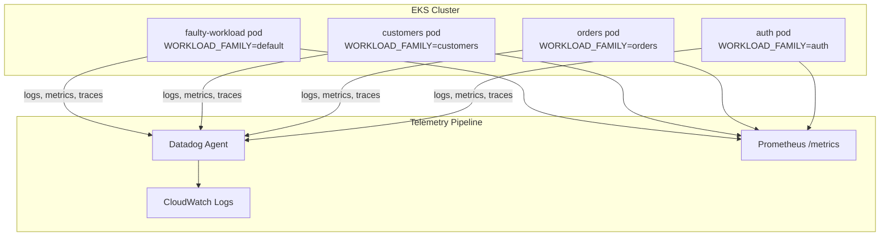

# Design Document: Add Observables

## Overview

This design extends the existing `faulty-workload` service to run three additional variant pods — `customers`, `orders`, and `auth` — that serve as purely observable targets for the POC telemetry pipeline. Each variant produces domain-themed fault profiles while reusing the identical Docker image and codebase. Differentiation is achieved entirely through the `WORKLOAD_FAMILY` environment variable, which selects a preset fault-parameter profile at startup.

The variants exist to generate diverse, realistic telemetry patterns (logs, metrics, traces) so the analyzer pipeline can validate its incident correlation and RCA capabilities against multiple distinguishable failure modes simultaneously.

### Key Design Decisions

1. **Single image, config-driven variants** — No code forks. The same `faulty-workload` Docker image is deployed three additional times with different env-var profiles. This minimizes maintenance and ensures telemetry contract consistency.
2. **Profile registry pattern** — A new `profiles.py` module maps `WORKLOAD_FAMILY` values to dictionaries of fault parameters. The existing `faults.py` already reads its tuning knobs from env vars; the profile module simply provides sensible defaults per domain that can still be overridden per-env-var.
3. **Additive change only** — The existing `faulty-workload` deployment remains unchanged. The three new deployments are independent K8s Deployments sharing the same image.

## Architecture



All four pods (existing + three new) share:
- The same FastAPI application (`app.py`)
- The same fault-injection engine (`faults.py`)
- The same structured JSON logger (`logger.py`)
- The same Prometheus metrics registry (`metrics.py`)
- The same trace-context middleware (`context.py`)

The only runtime difference is the set of environment variables injected by the K8s Deployment manifest.

## Components and Interfaces

### 1. `profiles.py` — Fault Profile Registry (NEW)

A pure-data module that maps `WORKLOAD_FAMILY` string values to dictionaries of fault-injection parameters.

```python
"""Fault profile registry.

Maps WORKLOAD_FAMILY env-var values to per-variant fault parameter overrides.
"""

from __future__ import annotations

PROFILES: dict[str, dict[str, str]] = {
    "default": {
        # Original faulty-workload profile — unchanged
        "HTTP_500_PROBABILITY": "0.05",
        "LATENCY_SPIKE_PROBABILITY": "0.05",
        "LATENCY_SPIKE_MIN_S": "2.0",
        "LATENCY_SPIKE_MAX_S": "5.0",
        "TIMEOUT_EVERY_N": "50",
        "MEMORY_PRESSURE_THRESHOLD": "100",
    },
    "customers": {
        # Customer-service theme: higher warning rate, moderate errors
        "HTTP_500_PROBABILITY": "0.03",
        "LATENCY_SPIKE_PROBABILITY": "0.08",
        "LATENCY_SPIKE_MIN_S": "1.0",
        "LATENCY_SPIKE_MAX_S": "3.0",
        "TIMEOUT_EVERY_N": "80",
        "MEMORY_PRESSURE_THRESHOLD": "60",
    },
    "orders": {
        # Order-processing theme: frequent timeouts, longer latency spikes
        "HTTP_500_PROBABILITY": "0.04",
        "LATENCY_SPIKE_PROBABILITY": "0.06",
        "LATENCY_SPIKE_MIN_S": "3.0",
        "LATENCY_SPIKE_MAX_S": "8.0",
        "TIMEOUT_EVERY_N": "30",
        "MEMORY_PRESSURE_THRESHOLD": "120",
    },
    "auth": {
        # Auth theme: higher error rate, short but frequent spikes
        "HTTP_500_PROBABILITY": "0.08",
        "LATENCY_SPIKE_PROBABILITY": "0.10",
        "LATENCY_SPIKE_MIN_S": "0.5",
        "LATENCY_SPIKE_MAX_S": "2.0",
        "TIMEOUT_EVERY_N": "100",
        "MEMORY_PRESSURE_THRESHOLD": "200",
    },
}


def get_profile(family: str) -> dict[str, str]:
    """Return fault parameters for a workload family.

    Falls back to 'default' if the family is not registered.
    """
    return PROFILES.get(family, PROFILES["default"])
```

### 2. `app.py` — Startup Profile Application (MODIFICATION)

At application startup, before the `faults.py` module reads env vars, `app.py` will:

1. Read `WORKLOAD_FAMILY` (default: `"default"`).
2. Look up the profile from `profiles.py`.
3. For each parameter in the profile, set the env var **only if it is not already explicitly set** (allowing per-deployment overrides to win).
4. Add `workload_family` to every structured log record via an extra field on the logger.

```python
# --- Profile application (top of app.py, after load_dotenv) ---
import os
from profiles import get_profile

WORKLOAD_FAMILY = os.environ.get("WORKLOAD_FAMILY", "default")
_profile = get_profile(WORKLOAD_FAMILY)
for key, value in _profile.items():
    os.environ.setdefault(key, value)
```

### 3. `logger.py` — `workload_family` Field (MODIFICATION)

The `JsonFormatter.format()` method will include a `workload_family` field sourced from the `WORKLOAD_FAMILY` env var. This ensures every log line is filterable by variant.

```python
payload = {
    "timestamp": timestamp,
    "service": self._service_name,
    "workload_family": os.environ.get("WORKLOAD_FAMILY", "default"),
    "severity": record.levelname,
    "trace_id": trace_id,
    "request_id": request_id,
    "error_type": getattr(record, "error_type", ""),
    "message": record.getMessage(),
}
```

### 4. `metrics.py` — `workload_family` Label (MODIFICATION)

All Prometheus counters and the histogram will gain a constant `workload_family` label. Since this is set once at startup, it remains low-cardinality (one value per pod).

```python
_WORKLOAD_FAMILY = os.environ.get("WORKLOAD_FAMILY", "default")

request_count: Counter = Counter(
    "request_count_total",
    "Total HTTP requests.",
    labelnames=["workload_family"],
)
# Usage: request_count.labels(workload_family=_WORKLOAD_FAMILY).inc()
```

### 5. K8s Deployment Manifests (NEW)

Three new YAML files (or a single multi-document file `k8s/observable-workloads.yaml`) containing Deployments and Services for `customers`, `orders`, and `auth`. Each is identical to `k8s/faulty-workload.yaml` except for:

| Field | customers | orders | auth |
|-------|-----------|--------|------|
| `metadata.name` | `customers-workload` | `orders-workload` | `auth-workload` |
| `app` label | `customers-workload` | `orders-workload` | `auth-workload` |
| `SERVICE_NAME` | `customers-workload` | `orders-workload` | `auth-workload` |
| `WORKLOAD_FAMILY` | `customers` | `orders` | `auth` |
| `DD_SERVICE` | `customers-workload` | `orders-workload` | `auth-workload` |

All other env vars (fault parameters) can be omitted — `profiles.py` provides the defaults. Operators may still override specific knobs per-deployment.

### 6. `docker-compose.yml` — Local Dev Services (MODIFICATION)

Three new service entries for local development, all using `build: ./faulty-workload` with different port mappings and env vars.

## Data Models

### Structured Log Schema (unchanged, one new field)

```json
{
  "timestamp": "2024-01-15T12:34:56.789012Z",
  "service": "customers-workload",
  "workload_family": "customers",
  "severity": "WARNING",
  "trace_id": "abc-123-def",
  "request_id": "req-789",
  "error_type": "dependency_timeout",
  "message": "Simulated dependency timeout on request #80 (fires every 80 requests)"
}
```

### Prometheus Metrics (labels extended)

| Metric | Type | Labels |
|--------|------|--------|
| `request_count_total` | Counter | `workload_family` |
| `error_count_total` | Counter | `workload_family` |
| `warning_count_total` | Counter | `workload_family`, `warning_type` |
| `timeout_count_total` | Counter | `workload_family` |
| `latency_ms` | Histogram | `workload_family` |

### Fault Profile Data Structure

```python
# Type: dict[str, dict[str, str]]
# Key: WORKLOAD_FAMILY value (str)
# Value: dict mapping env-var names to default string values
{
    "customers": {
        "HTTP_500_PROBABILITY": "0.03",
        "LATENCY_SPIKE_PROBABILITY": "0.08",
        ...
    }
}
```

### Environment Variables (per variant)

| Variable | Purpose | Required |
|----------|---------|----------|
| `WORKLOAD_FAMILY` | Selects fault profile | Yes (defaults to `"default"`) |
| `SERVICE_NAME` | Logger service name & DD_SERVICE | Yes |
| `FAULT_SAMPLE_RATE` | Fraction of healthy requests logged | No (default `0.1`) |
| `HTTP_500_PROBABILITY` | Override profile's 500 rate | No |
| `LATENCY_SPIKE_PROBABILITY` | Override profile's spike rate | No |
| `LATENCY_SPIKE_MIN_S` | Override min spike duration | No |
| `LATENCY_SPIKE_MAX_S` | Override max spike duration | No |
| `TIMEOUT_EVERY_N` | Override timeout interval | No |
| `MEMORY_PRESSURE_THRESHOLD` | Override memory-pressure interval | No |


## Correctness Properties

*A property is a characteristic or behavior that should hold true across all valid executions of a system — essentially, a formal statement about what the system should do. Properties serve as the bridge between human-readable specifications and machine-verifiable correctness guarantees.*

### Property 1: Profile resolution returns valid configuration

*For any* registered `WORKLOAD_FAMILY` value (including `"default"`, `"customers"`, `"orders"`, `"auth"`), calling `get_profile(family)` SHALL return a dictionary containing all required fault parameter keys (`HTTP_500_PROBABILITY`, `LATENCY_SPIKE_PROBABILITY`, `LATENCY_SPIKE_MIN_S`, `LATENCY_SPIKE_MAX_S`, `TIMEOUT_EVERY_N`, `MEMORY_PRESSURE_THRESHOLD`) with values parseable as their expected numeric types.

**Validates: Requirements 1.1, 2.1, 3.1**

### Property 2: Log format completeness

*For any* log record with arbitrary `severity`, `message`, `trace_id`, `request_id`, `error_type`, and `workload_family` values, the `JsonFormatter.format()` output SHALL be valid JSON containing all required fields: `timestamp`, `service`, `workload_family`, `severity`, `trace_id`, `request_id`, `error_type`, and `message`.

**Validates: Requirements 1.2, 2.2, 3.2, 4.1, 5.1**

### Property 3: Trace ID propagation round-trip

*For any* non-empty `trace_id` string set in the `trace_id_var` context variable, formatting a log record SHALL produce JSON whose `trace_id` field equals the value that was set.

**Validates: Requirements 1.3, 2.3, 3.3, 5.3**

### Property 4: Error-type stability for faults

*For any* `FaultResult` instance with a non-empty `warning_type`, when the corresponding log record is formatted, the output JSON SHALL contain an `error_type` field equal to that `warning_type` value.

**Validates: Requirements 5.4**

### Property 5: Environment variable override precedence

*For any* `WORKLOAD_FAMILY` profile and *for any* subset of fault parameters explicitly set as environment variables before profile application, the explicitly-set values SHALL take precedence over the profile defaults, while unset parameters SHALL resolve to the profile's values.

**Validates: Requirements 6.2**

## Error Handling

| Scenario | Behavior |
|----------|----------|
| Unknown `WORKLOAD_FAMILY` value | Fall back to `"default"` profile; log a warning at startup |
| `profiles.py` returns incomplete dict | `faults.py` already has hardcoded defaults in its env-var reads; missing keys resolve to existing defaults (e.g., `"0.05"` for `HTTP_500_PROBABILITY`) |
| Trace propagation failure (missing header, context var not set) | Existing behavior: generate a fresh UUID and continue — no request failure |
| Non-numeric env-var override (e.g., `HTTP_500_PROBABILITY=abc`) | `faults.py` will raise `ValueError` at import time; fail-fast on deployment so the operator notices immediately |
| Prometheus label cardinality issue | `workload_family` is a constant per pod (set once at startup); cannot explode cardinality unless a user injects arbitrary values |
| Logger import error | Fail-fast — the service cannot run without structured logging |

## Testing Strategy

### Unit Tests (example-based)

| Test | What it verifies |
|------|-----------------|
| `test_get_profile_known_families` | Each registered family returns the expected dict |
| `test_get_profile_unknown_family_falls_back` | Unknown family returns `"default"` profile |
| `test_log_format_valid_json` | A sample log record formats to parseable JSON with all fields |
| `test_metrics_workload_family_label` | Counter/histogram expose `workload_family` label |
| `test_env_override_wins` | Explicitly-set env var is not overwritten by profile |
| `test_profile_application_sets_unset_vars` | Profile values are applied for vars not already in env |
| `test_health_endpoint_returns_200` | GET `/` returns 200 when no hard fault fires |

### Property-Based Tests (Hypothesis)

The property-based testing library is **Hypothesis** (Python). Each test runs a minimum of **100 iterations**.

| Property | Test tag |
|----------|----------|
| Property 1: Profile resolution | `Feature: add-observables, Property 1: Profile resolution returns valid configuration` |
| Property 2: Log format completeness | `Feature: add-observables, Property 2: Log format completeness` |
| Property 3: Trace ID propagation | `Feature: add-observables, Property 3: Trace ID propagation round-trip` |
| Property 4: Error-type stability | `Feature: add-observables, Property 4: Error-type stability for faults` |
| Property 5: Env-var override precedence | `Feature: add-observables, Property 5: Environment variable override precedence` |

Each property test will:
- Use `@settings(max_examples=100)` minimum
- Reference the design property in a docstring/comment
- Use `@given(...)` with appropriate strategies for the input domain

### Integration Tests

| Test | What it verifies |
|------|-----------------|
| `test_variant_emits_health_signal` | Running variant emits periodic health log within configured interval |
| `test_variant_telemetry_distinguishable` | Two variants produce logs with different `workload_family` values |
| `test_trace_correlation_across_variants` | Shared trace_id in request headers appears in both variants' logs |

### Deployment Smoke Tests

| Test | What it verifies |
|------|-----------------|
| `test_all_variants_start` | All three variant pods reach `Ready` state in K8s |
| `test_same_image_different_config` | All variant pods use the same container image hash |
| `test_prometheus_endpoint_reachable` | `/metrics` responds on each variant's service |
