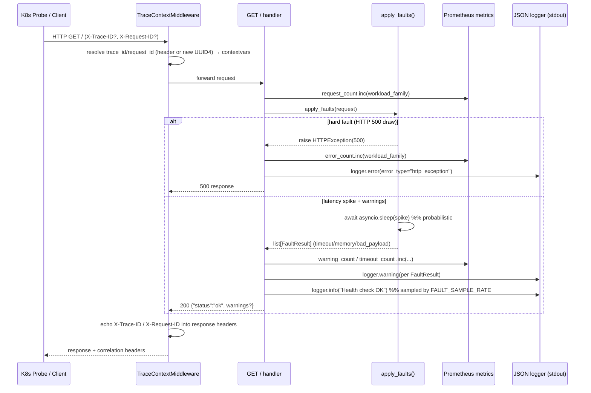
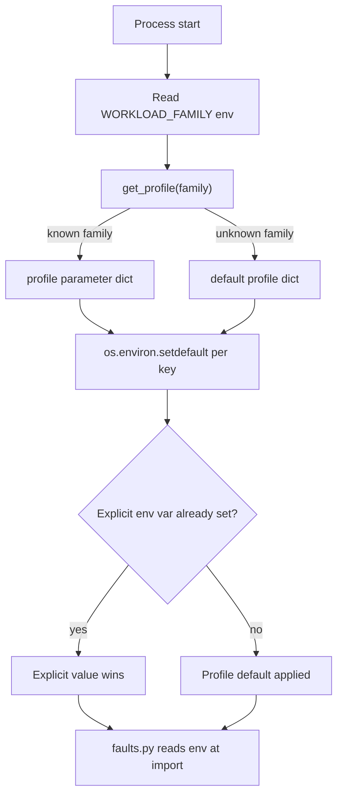
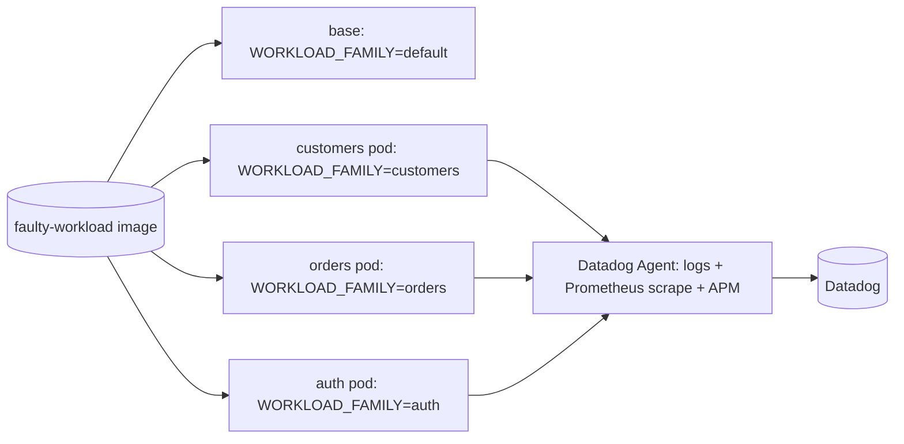

# Design Document: add-observables

## Overview

This feature brings the existing `faulty-workload` FastAPI service — originally built in the separate `poc` repository under the `cloudwatch-poc` workflow (`../poc/faulty-workload`) — into this repository as the foundation (Requirement 0), then runs three configuration-driven variant pods on EKS/EC2: `customers`, `orders`, and `auth` (Requirements 1–3).

All three variants and the base service share **one Docker image and one source tree**. Behavior is differentiated entirely through the `WORKLOAD_FAMILY` environment variable, which selects a domain-themed **fault profile** (HTTP-500 probability, latency-spike probability/duration, dependency-timeout interval, memory-pressure threshold) at startup. The variants are **purely observable targets**: they exist only to emit telemetry — structured single-line JSON logs, low-cardinality Prometheus metrics, and propagated trace/request IDs — consumed by the analyzer/POC pipeline and surfaced in Datadog.

The design is a **faithful port** of the proven `cloudwatch-poc` implementation. The telemetry contract (log schema, metric names/labels, trace propagation) is locked by Requirement 0 and inherited unchanged by every variant. The net new work in this repository is: (a) copying the source modules into a `faulty-workload/` directory, (b) confirming the profile registry covers all three families, and (c) providing the deployment artifacts (Dockerfile, `docker-compose`, Kubernetes manifests) that launch the four families from the single image.

### Goals

- Establish the base `faulty-workload` telemetry contract in this repo without altering it.
- Run `customers`, `orders`, and `auth` as separate pods from one image via `WORKLOAD_FAMILY`.
- Keep every variant distinguishable in telemetry via the `workload_family` dimension.
- Keep health-signal log volume tunable (`FAULT_SAMPLE_RATE`) to stay within POC cost limits.

### Non-Goals

- No real business logic or persistence — these are synthetic fault emitters only.
- No changes to the analyzer pipeline or Datadog dashboards (covered by other specs).
- No per-variant source trees or per-variant images.

## Architecture

### Source Layout (ported into this repo)

```
faulty-workload/
├── app.py            # FastAPI app, TraceContextMiddleware, GET / handler, /metrics mount
├── faults.py         # apply_faults() fault-injection engine (env-configured)
├── profiles.py       # WORKLOAD_FAMILY → fault-parameter registry + get_profile()
├── logger.py         # JsonFormatter + get_logger() structured JSON logging
├── metrics.py        # Prometheus counters/histogram + /metrics ASGI app
├── context.py        # contextvars for trace_id / request_id propagation
├── requirements.txt  # fastapi, uvicorn, prometheus-client, python-dotenv, ddtrace, boto3
└── Dockerfile        # single image used by all families
```

### Runtime Request Flow



### Configuration Resolution at Startup (Requirement 0.7, 6.1, 6.2)



The precedence rule is implemented with `os.environ.setdefault`: the profile supplies defaults only for keys not already present in the environment, so any explicitly-set fault knob overrides the profile. This ordering **must** run before `faults.py` is imported, because `faults.py` reads its configuration once at import time.

### Deployment Topology

All four families run from `image: faulty-workload:latest`, differentiated by env only.



- **Local**: `docker-compose` builds the image once and runs each family as a service on distinct host ports (8080–8083) with `FAULT_SAMPLE_RATE=1.0` for visibility; a Datadog Agent container collects container logs and scrapes each `/metrics` endpoint.
- **Kubernetes (EKS/EC2)**: one `Deployment` + `Service` per variant, each with readiness/liveness probes hitting `/`. Probe traffic provides the periodic health signal even with no business traffic; cadence is set by each probe's `periodSeconds`. `DD_AGENT_HOST` is injected from `status.hostIP` so pods reach the node-local Datadog Agent.

## Components and Interfaces

### `app.py` — Service entrypoint and HTTP surface

- `TraceContextMiddleware.dispatch(request, call_next)`: reads `X-Trace-ID`/`X-Request-ID`, generates UUID4 when absent, stores both in contextvars, echoes both into response headers.
- `GET /` (`health_check`): increments `request_count`, calls `apply_faults`, records `latency_ms`, increments `error_count`/`warning_count`/`timeout_count` as appropriate, emits sampled "Health check OK" info log, returns `{"status":"ok", "service":..., "warnings"?:[...]}`.
- `app.mount("/metrics", metrics_app)`: exposes the Prometheus endpoint.
- Startup block: resolves `WORKLOAD_FAMILY`, applies profile via `setdefault`, computes `_FAULT_SAMPLE_RATE` clamped to `[0.0, 1.0]`.

### `faults.py` — Fault-injection engine

- `apply_faults(request) -> list[FaultResult]`: increments a lock-protected global counter, then:
  - `_maybe_http_500()` — raises `HTTPException(500)` with probability `HTTP_500_PROBABILITY`.
  - `_maybe_latency_spike()` — `await asyncio.sleep(uniform(MIN_S, MAX_S))` with probability `LATENCY_SPIKE_PROBABILITY`.
  - `_maybe_timeout(n)` — returns a `dependency_timeout` `FaultResult` every `TIMEOUT_EVERY_N` requests.
  - `_maybe_memory_pressure(n)` — returns a `memory_pressure` `FaultResult` on multiples of `MEMORY_PRESSURE_THRESHOLD`.
  - `_maybe_bad_payload(request)` — returns a `bad_payload` `FaultResult` when `?payload=bad|malformed`.
- All thresholds/probabilities read from env once at import time.

### `profiles.py` — Fault profile registry

- `PROFILES: dict[str, dict[str, str]]` with entries for `default`, `customers`, `orders`, `auth`.
- `get_profile(family) -> dict[str, str]`: returns the family's parameter dict, falling back to `default` for unknown families.

### `logger.py` — Structured JSON logging

- `JsonFormatter(service_name).format(record) -> str`: emits a single-line JSON object with `timestamp` (ISO-8601 UTC), `service`, `workload_family`, `severity`, `trace_id`, `request_id`, `error_type`, `message`. Resolves `trace_id`/`request_id` from record `extra` first, then contextvars, then `""`.
- `get_logger(service_name)`: idempotent logger factory writing to stdout, `propagate=False`.

### `metrics.py` — Prometheus instruments

- Counters: `request_count_total{workload_family}`, `warning_count_total{workload_family,warning_type}`, `error_count_total{workload_family}`, `timeout_count_total{workload_family}`, `restart_count_total`.
- Histogram: `latency_ms{workload_family}` with fixed buckets.
- `metrics_app = make_asgi_app()` mounted at `/metrics`.

### `context.py` — Request-scoped propagation

- `trace_id_var`, `request_id_var` (`ContextVar`, default `""`); `get_trace_id()`, `get_request_id()` accessors.

### Deployment interfaces

- `Dockerfile`: single image; `CMD uvicorn app:app --host 0.0.0.0 --port 8080`.
- `docker-compose.yml`: one build context shared by all family services; Datadog Agent with `DD_PROMETHEUS_SCRAPE_CHECKS` listing each variant's `/metrics`.
- Kubernetes manifests: per-variant `Deployment`+`Service`; env block sets `SERVICE_NAME`, `WORKLOAD_FAMILY`, `DD_SERVICE`/`DD_ENV`/`DD_VERSION`, `DD_AGENT_HOST` (from `status.hostIP`), `FAULT_SAMPLE_RATE`; readiness/liveness probes on `/`.

## Data Models

### FaultResult

```python
@dataclass
class FaultResult:
    warning_type: str  # "dependency_timeout" | "memory_pressure" | "bad_payload"
    message: str       # human-readable description
```

### Fault profile entry

A mapping of fault-tuning env keys to string values (kept as strings because they are pushed into `os.environ`):

| Key | default | customers | orders | auth |
|-----|---------|-----------|--------|------|
| `HTTP_500_PROBABILITY` | 0.05 | 0.03 | 0.04 | 0.08 |
| `LATENCY_SPIKE_PROBABILITY` | 0.05 | 0.08 | 0.06 | 0.10 |
| `LATENCY_SPIKE_MIN_S` | 2.0 | 1.0 | 3.0 | 0.5 |
| `LATENCY_SPIKE_MAX_S` | 5.0 | 3.0 | 8.0 | 2.0 |
| `TIMEOUT_EVERY_N` | 50 | 80 | 30 | 100 |
| `MEMORY_PRESSURE_THRESHOLD` | 100 | 60 | 120 | 200 |

### Structured log line (JSON schema)

```json
{
  "timestamp": "2024-01-15T12:34:56.789012Z",
  "service": "customers-workload",
  "workload_family": "customers",
  "severity": "WARNING",
  "trace_id": "f3c9...",
  "request_id": "a17b...",
  "error_type": "memory_pressure",
  "message": "Memory pressure warning: ..."
}
```

### Environment configuration model

| Variable | Purpose |
|----------|---------|
| `SERVICE_NAME` | Logical `service` field / Datadog service name |
| `WORKLOAD_FAMILY` | Selects fault profile and tags all telemetry |
| `FAULT_SAMPLE_RATE` | Fraction of healthy requests that emit an info log (clamped to `[0,1]`) |
| `HTTP_500_PROBABILITY`, `LATENCY_SPIKE_PROBABILITY`, `LATENCY_SPIKE_MIN_S`, `LATENCY_SPIKE_MAX_S`, `TIMEOUT_EVERY_N`, `MEMORY_PRESSURE_THRESHOLD` | Per-variant fault tuning (override profile defaults) |
| `DD_AGENT_HOST`, `DD_SERVICE`, `DD_ENV`, `DD_VERSION` | Datadog observability wiring |

## Correctness Properties

*A property is a characteristic or behavior that should hold true across all valid executions of a system — essentially, a formal statement about what the system should do. Properties serve as the bridge between human-readable specifications and machine-verifiable correctness guarantees.*

PBT applies here to the **pure logic layer** of this feature: configuration/profile resolution, JSON log formatting, trace-ID handling, deterministic periodic faults, and sample-rate clamping. Deployment artifacts (Dockerfile, `docker-compose`, Kubernetes manifests), the fixed `/metrics` instrument set, and the source-port step are verified by smoke/example/integration tests instead (see Testing Strategy), because they do not vary meaningfully with input.

The properties below are consolidated from the prework analysis to remove redundancy: variant-specific criteria (Requirements 1–3) and the shared-contract criteria (Requirement 5) collapse into the same family-parameterized properties as their Requirement 0 counterparts.

### Property 1: Profile resolution honors explicit overrides and fills defaults

*For any* `WORKLOAD_FAMILY` value (known or unknown) and *any* subset of fault-parameter environment variables pre-set with arbitrary values, after startup resolution every pre-set key retains its explicit value, and every unset key equals the corresponding value from `get_profile(family)` — where an unknown family resolves to the `default` profile.

**Validates: Requirements 0.7, 1.1, 2.1, 3.1, 6.1, 6.2**

### Property 2: Log lines are single-line JSON carrying the full telemetry contract

*For any* log record (arbitrary severity, message, `trace_id`, `request_id`, `error_type`) emitted under *any* `workload_family`, the formatted output contains no embedded newline, parses as a single JSON object, and includes all eight required fields (`timestamp`, `service`, `workload_family`, `severity`, `trace_id`, `request_id`, `error_type`, `message`) with `workload_family` equal to the configured family and `error_type` equal to the supplied stable label (or `""` when none was supplied).

**Validates: Requirements 0.3, 1.2, 2.2, 3.2, 4.1, 5.1, 5.4**

### Property 3: Trace and request IDs are always present, echoed, or validly generated

*For any* incoming request with an arbitrary combination of present/absent `X-Trace-ID` and `X-Request-ID` headers, the response carries both headers; when a header was supplied, the echoed value equals the supplied value; when a header was absent, the echoed value is a valid UUID4; and the resolved values are the same ones exposed to downstream logging via the request-scoped context.

**Validates: Requirements 0.5, 1.3, 2.3, 3.3, 5.3**

### Property 4: Deterministic periodic faults fire exactly on their configured interval

*For any* positive interval `N` and *any* request-counter value `c`, the dependency-timeout fault is produced if and only if `c % N == 0`, and the memory-pressure warning is produced if and only if `c % MEMORY_PRESSURE_THRESHOLD == 0`; when the interval is non-positive, the corresponding fault is never produced.

**Validates: Requirements 0.2**

### Property 5: Sample rate is always clamped to a valid probability

*For any* `FAULT_SAMPLE_RATE` input value, the resolved sample rate lies within the closed interval `[0.0, 1.0]`, and equals the input value when the input is already within that interval.

**Validates: Requirements 6.3, 1.4, 2.4, 3.4**

## Error Handling

- **Hard fault (injected HTTP 500):** `apply_faults` raises `HTTPException(500)`; the handler increments `error_count`, records latency, logs at `error` with `error_type="http_exception"`, and re-raises so FastAPI returns a 500. The trace/request IDs are still echoed by the middleware on the error response.
- **Warning-class faults:** dependency-timeout, memory-pressure, and bad-payload are collected as `FaultResult`s, logged at `warning` with their stable `warning_type`, surfaced in the response body under `warnings`, and counted via `warning_count`/`timeout_count`. They never abort the request.
- **Trace propagation failure (Req 1.3/2.3/3.3):** if setting or reading the request-scoped context fails, the request continues to completion and the failure is logged (the logger falls back to `""` for any unresolved ID rather than raising). No request is dropped because of a propagation error.
- **Unknown `WORKLOAD_FAMILY`:** `get_profile` falls back to the `default` profile rather than failing startup.
- **Out-of-range `FAULT_SAMPLE_RATE`:** clamped into `[0.0, 1.0]`; malformed values surface as a startup configuration error from the float conversion.
- **Datadog Agent unavailable:** telemetry emission (stdout logs, `/metrics`) is independent of agent reachability; the service stays healthy and probes continue to pass even if the agent is temporarily down.

## Testing Strategy

### Property-based tests

- Use **Hypothesis** (already present in the repo — see `.hypothesis/`) for the Python service.
- Each correctness property maps to a **single** property-based test, configured to run a **minimum of 100 iterations**.
- Each test is tagged with a comment referencing its design property, format:
  `# Feature: add-observables, Property {number}: {property_text}`
- Property → test mapping:
  - Property 1 → generate random family + random preset-env subset, run the `setdefault` resolution, assert precedence + defaults.
  - Property 2 → generate random log records via a FastAPI/`caplog`-style harness, assert single-line JSON + full field set + `workload_family`/`error_type` values.
  - Property 3 → drive the app with `TestClient`, generating present/absent header combinations, assert echo/generation/validity.
  - Property 4 → generate random interval `N` and counter values, assert `_maybe_timeout`/`_maybe_memory_pressure` periodicity.
  - Property 5 → generate arbitrary floats, assert clamping invariant.

### Example / unit tests

- `/metrics` exposes exactly the expected instrument set and only low-cardinality labels (`workload_family`, `warning_type`) — no `trace_id`/`request_id` labels (Req 0.4, 5.2).
- Trace-propagation failure path: inject a context error and assert the request still returns 200 and a propagation-failure line is logged (Req 1.3/2.3/3.3).
- Health-check happy path: `GET /` returns `{"status":"ok"}`, increments `request_count`, and emits a sampled info log (Req 1.4/2.4/3.4).

### Smoke / configuration tests

- Ported modules import cleanly and expose expected public symbols (Req 0.1).
- A single image builds and the service starts from env-only configuration (Req 0.6).
- All four families in `docker-compose` and all variant Deployments reference the **single** `faulty-workload` build context/image (Req 6.5).
- Each variant Deployment defines readiness/liveness probes on `/` with a `periodSeconds` cadence (Req 6.4).
- Separate Deployments/Services per variant keep `workload_family` distinct so single-variant incidents stay isolated (Req 4.2, 4.3).

### Integration tests

- Bring up `docker-compose` with the Datadog Agent and confirm each variant's logs are collected and each `/metrics` endpoint is scraped, with `workload_family` distinguishing the streams (Req 4.1, 5.2). 1–3 representative runs, not property-based.

### Testing balance

Property tests carry the universal guarantees (config precedence, log schema, ID propagation, fault periodicity, clamping). Example, smoke, and integration tests cover the fixed instrument set, deployment wiring, and the error/edge paths that do not vary meaningfully with input.
