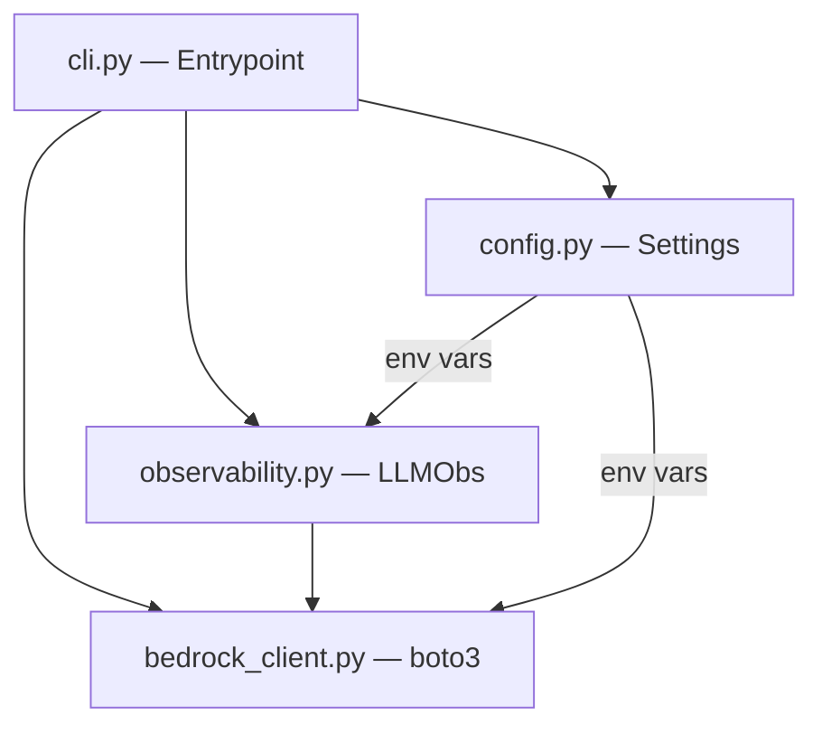
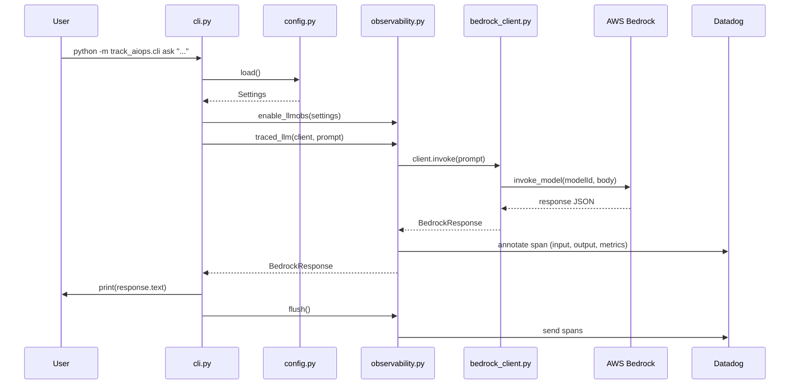

# Design Document: `track_aiops` Package (Bedrock + Datadog LLM Observability)

## Overview

The `track_aiops` package provides a single CLI command (`python -m track_aiops.cli ask "..."`) that calls AWS Bedrock Nova Pro and emits an LLM span to Datadog LLM Observability — from our own application, not the starter scripts.

This package serves as the foundation for earning hackathon points (DD #1 First Trace, AWS #1 Bedrock Online) and is designed for additive growth toward other hackathon checkpoints (Tool Call Visible, Cost Tracked, Multi-Step Agent, etc.) without requiring architectural changes.

The design separates concerns cleanly: Bedrock transport is isolated from observability instrumentation, which is isolated from CLI orchestration. This enables each module to evolve independently as new checkpoint requirements are layered on.

## Architecture



```
track_aiops/
├── __init__.py
├── config.py          # Settings dataclass, load() with fail-fast validation
├── bedrock_client.py  # BedrockClient wrapping boto3, BedrockResponse dataclass
├── observability.py   # enable_llmobs() + @llm traced_llm() wrapper
└── cli.py             # Entrypoint: parse args → invoke → print → flush
```

### Module Boundaries

- `bedrock_client` has zero Datadog knowledge — pure boto3 transport.
- `observability` has zero CLI/IO knowledge — reusable by future workflows.
- `cli` owns orchestration and stdout only.

## Components and Interfaces

### Component 1: `config.py` — Configuration

**Purpose**: Load and validate environment variables at startup, fail fast on missing required values.

**Interface**:
```python
@dataclass
class Settings:
    dd_api_key: str
    dd_site: str           # default: "datadoghq.com"
    dd_llmobs_ml_app: str
    aws_region: str        # default: "us-east-1"
    model_id: str          # constant: "amazon.nova-pro-v1:0"
    model_name: str        # constant: "nova-pro"
    model_provider: str    # constant: "bedrock"

def load() -> Settings:
    """Load settings from env. Raises ValueError with missing var name."""
    ...
```

**Responsibilities**:
- Call `load_dotenv()` to read `.env` file
- Validate required env vars: `DD_API_KEY`, `DD_LLMOBS_ML_APP`, `AWS_ACCESS_KEY_ID`, `AWS_SECRET_ACCESS_KEY`
- Apply defaults for `AWS_REGION` and `DD_SITE`
- Raise `ValueError` with the exact missing var name on failure

### Component 2: `bedrock_client.py` — AWS Bedrock Transport

**Purpose**: Wrap boto3 Bedrock runtime calls, returning structured response data.

**Interface**:
```python
@dataclass
class BedrockResponse:
    text: str
    usage: dict        # {"inputTokens": int, "outputTokens": int, "totalTokens": int}
    stop_reason: str

class BedrockClient:
    def __init__(self, region: str, model_id: str): ...
    def invoke(self, prompt: str) -> BedrockResponse: ...
```

**Responsibilities**:
- Create boto3 `bedrock-runtime` client
- Format request body per Nova family schema
- Parse response JSON into `BedrockResponse`
- Raise `BedrockAuthError` or `BedrockResponseError` on failures

### Component 3: `observability.py` — Datadog LLM Observability

**Purpose**: Initialize LLMObs and provide a traced wrapper for LLM calls.

**Interface**:
```python
def enable_llmobs(settings: Settings) -> None:
    """Enable LLMObs in agentless mode."""
    ...

@llm(model_name="nova-pro", model_provider="bedrock")
def traced_llm(client: BedrockClient, prompt: str) -> BedrockResponse:
    """Invoke Bedrock and annotate the span with input/output/metrics."""
    ...

def flush() -> None:
    """Flush all pending spans to Datadog."""
    ...
```

**Responsibilities**:
- Call `LLMObs.enable(agentless_enabled=True, ...)` once at startup
- Decorate LLM calls with `@llm` for automatic span creation
- Annotate spans with `input_data`, `output_data`, and token `metrics`
- Provide `flush()` to ensure spans are sent before process exit

### Component 4: `cli.py` — CLI Entrypoint

**Purpose**: Parse arguments, orchestrate the call chain, print output, ensure flush.

**Interface**:
```python
def main() -> None:
    """Entry point: parse args → config → enable obs → call LLM → print → flush."""
    ...
```

**Responsibilities**:
- Parse `ask "<prompt>"` from sys.argv
- Load config, enable observability
- Call `traced_llm(client, prompt)`
- Print response text to stdout
- Always call `flush()` in a `finally` block

## Data Models

### Model 1: `Settings`

```python
@dataclass
class Settings:
    dd_api_key: str
    dd_site: str
    dd_llmobs_ml_app: str
    aws_region: str
    model_id: str
    model_name: str
    model_provider: str
```

**Validation Rules**:
- `dd_api_key` must be non-empty string
- `dd_llmobs_ml_app` must be non-empty string
- `aws_region` defaults to `"us-east-1"` if not set
- `dd_site` defaults to `"datadoghq.com"` if not set
- `model_id` is always `"amazon.nova-pro-v1:0"`

### Model 2: `BedrockResponse`

```python
@dataclass
class BedrockResponse:
    text: str
    usage: dict
    stop_reason: str
```

**Validation Rules**:
- `text` is extracted from `result["output"]["message"]["content"][0]["text"]`
- `usage` contains keys: `inputTokens`, `outputTokens`, `totalTokens`
- `stop_reason` is the model's stop reason string (e.g., `"end_turn"`)

### Bedrock Request Body Shape (Nova Family)

```json
{
  "messages": [{"role": "user", "content": [{"text": "<prompt>"}]}],
  "inferenceConfig": {"max_new_tokens": 1024}
}
```

## Data Flow



## Correctness Properties

### Property 1: Span Completeness

For all successful invocations, the emitted LLM span contains non-empty `input_data`, non-empty `output_data`, and `metrics` with `input_tokens > 0` and `output_tokens > 0`.

### Property 2: Flush Guarantee

For all executions (success or failure), `LLMObs.flush()` is called exactly once before process exit.

### Property 3: Config Fail-Fast

For all missing required env vars, `config.load()` raises `ValueError` naming the missing variable before any network call is made.

### Property 4: Transport Isolation

`bedrock_client` module has zero imports from `ddtrace` — observability never couples to transport.

### Property 5: Idempotent Enable

Calling `enable_llmobs()` multiple times does not create duplicate spans or raise errors.

## Error Handling

### Error Scenario 1: Missing Environment Variable

**Condition**: A required env var (`DD_API_KEY`, `DD_LLMOBS_ML_APP`, `AWS_ACCESS_KEY_ID`, `AWS_SECRET_ACCESS_KEY`) is unset or empty.
**Response**: `config.load()` raises `ValueError` with message identifying the exact missing variable.
**Recovery**: User sets the variable in `.env` or environment and re-runs.

### Error Scenario 2: AWS Authentication Failure

**Condition**: boto3 receives `ClientError` with auth-related error codes (e.g., `ExpiredTokenException`, `UnrecognizedClientException`).
**Response**: Raise `BedrockAuthError` with a hint to check credentials and region.
**Recovery**: User verifies AWS credentials and region setting.

### Error Scenario 3: Malformed Bedrock Response

**Condition**: Response JSON does not match expected Nova family output structure.
**Response**: Raise `BedrockResponseError` with the raw response body for debugging.
**Recovery**: Developer inspects the response format and adjusts parsing logic.

### Error Scenario 4: Network/Timeout Failure

**Condition**: boto3 raises connection or timeout errors.
**Response**: Let the exception propagate with context; `finally` block still calls `flush()`.
**Recovery**: User checks network connectivity and retries.

### Design Note

Graceful-error-as-span (marking the span with error status for DD #5 checkpoint) is out of scope for this initial slice. All errors still flush pending spans via the `finally` block.

## Testing Strategy

### Unit Testing Approach

- **config.py**: Test `load()` with monkeypatched env vars — verify correct Settings returned, verify ValueError on each missing required var.
- **bedrock_client.py**: Mock boto3 client, verify request body format, verify `BedrockResponse` parsing from mock response JSON, verify error classes raised on auth/parse failures.
- **observability.py**: Mock `LLMObs` module, verify `enable` called with correct params, verify `annotate` called with expected input/output/metrics, verify `flush` called.
- **cli.py**: Integration test with all mocks — verify end-to-end flow from args to stdout output.

### Property-Based Testing Approach

**Property Test Library**: `hypothesis`

- Any non-empty string prompt produces a well-formed Bedrock request body (valid JSON, correct structure).
- Token counts in `BedrockResponse.usage` are always non-negative integers.
- `config.load()` never silently returns default values for required keys.

### Integration Testing Approach

- Live smoke test: `python -m track_aiops.cli ask "Hello"` → exit code 0, non-empty stdout.
- Datadog verification: After smoke test, poll LLM Observability traces API for span with matching `ml_app` tag within 60s.

## Extension Points (Future Checkpoints)

This package is designed to grow additively:

| Future Checkpoint | What to Add | Where |
|---|---|---|
| Tool Call Visible (DD #3) | `@tool` decorated functions | new module or extend `observability.py` |
| Cost Tracked (DD #4) | Dashboard widget reading existing `metrics` annotation | Terraform / dashboard config |
| Error Handled (DD #5) | Catch + mark span as error + DD Monitor | `observability.py` error wrapper |
| End-to-End Demo (DD #6) | `@workflow` / `@task` decorators wrapping multi-step flow | new `agent.py` module |
| Multi-Step Agent (AWS #4) | Agentic loop with `toolConfig` | new `agent.py` module |

## Dependencies

- `boto3` — AWS SDK for Bedrock runtime calls
- `ddtrace` — Datadog tracing library with LLMObs support
- `python-dotenv` — Load `.env` files into environment

All already present in the project environment.

## Correctness Properties

*A property is a characteristic or behavior that should hold true across all valid executions of a system — essentially, a formal statement about what the system should do. Properties serve as the bridge between human-readable specifications and machine-verifiable correctness guarantees.*

### Property 1: Request body construction preserves prompt and format

*For any* valid prompt string, the request body constructed by BedrockClient SHALL contain the prompt embedded in the Nova message format (`messages[0].content[0].text == prompt`) with `inferenceConfig.max_new_tokens` set to 1024.

**Validates: Requirements 3.1, 3.5**

### Property 2: Response parsing extracts all fields correctly

*For any* valid Bedrock response JSON containing `output.message.content[0].text`, `usage` (with input/output/total tokens), and `stopReason`, parsing SHALL produce a BedrockResponse where each field matches the corresponding value in the source JSON.

**Validates: Requirement 3.2**

### Property 3: Malformed responses are rejected

*For any* JSON body that is missing required fields (`output.message.content[0].text` or `usage`), the BedrockClient response parser SHALL raise a BedrockResponseError.

**Validates: Requirement 3.4**

### Property 4: Missing required config raises with exact variable name

*For any* non-empty subset of required environment variables (DD_API_KEY, DD_LLMOBS_ML_APP, AWS_ACCESS_KEY_ID, AWS_SECRET_ACCESS_KEY) that is removed from the environment, `config.load()` SHALL raise an error whose message contains the name of at least one missing variable.

**Validates: Requirement 2.2**

### Property 5: Span annotation contains complete input, output, and metrics

*For any* prompt string and BedrockResponse with non-negative token counts, the observability annotation SHALL include input_data equal to the prompt, output_data equal to the response text, and metrics containing input_tokens, output_tokens, and total_tokens matching the BedrockResponse usage.

**Validates: Requirement 4.3**

## Verification

1. `python -m track_aiops.cli ask "What makes an AI system production-ready?"` prints a coherent answer, exit 0.
2. Within 60s, one LLM span appears in Datadog LLM Observability filtered by team `DD_LLMOBS_ML_APP`, showing model `nova-pro`, provider `bedrock`, non-zero tokens, and captured prompt/response.
