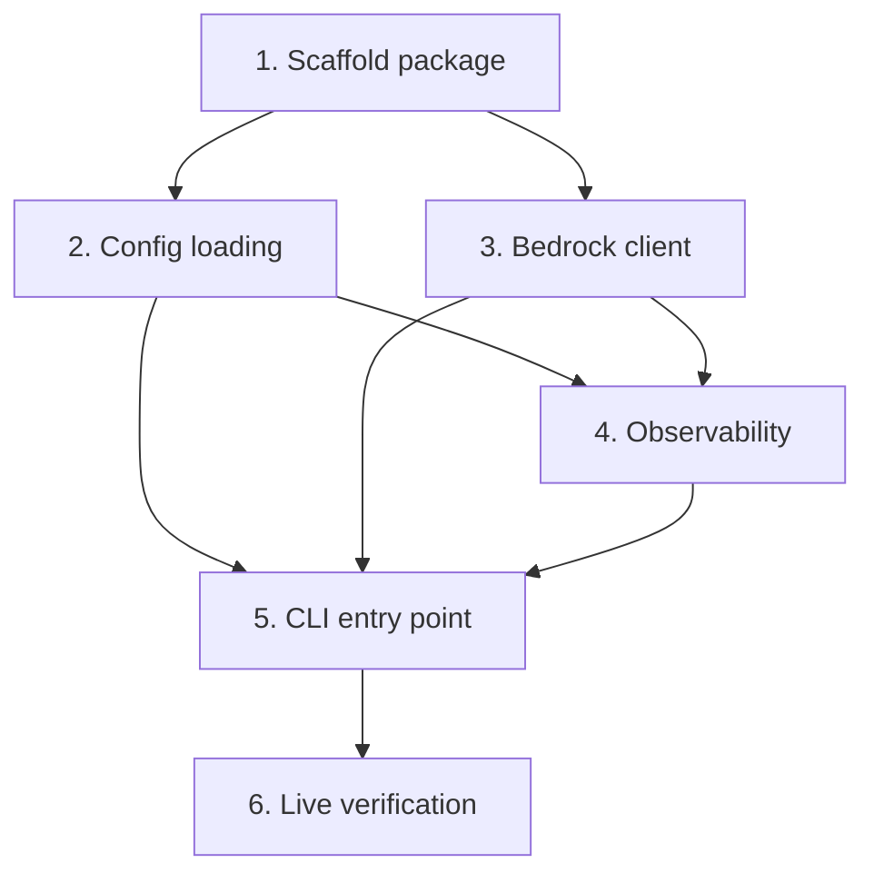

# Implementation Plan

## Overview

This plan implements the `track_aiops` package: a CLI that invokes AWS Bedrock Nova Pro and emits an LLM observability span to Datadog. Work proceeds bottom-up — configuration, transport, and observability layers are built and tested in isolation, then wired together in the CLI, and finally verified live against AWS and Datadog.

### Hackathon scoring targets

This slice directly earns three checkpoints from `.kiro/steering/hackathon-scoring-checklist.md` (200 pts + Kiro credit, each eligible for First Blood +50):

| Checkpoint | Points | Earned by | Evidence required |
|---|---|---|---|
| AWS #1 — Bedrock Online | 100 | Tasks 3, 5, 6 | Real Bedrock response text printed in the terminal from our app |
| DD #1 — First Trace | 100 | Tasks 4, 6 | One LLM span in Datadog LLM Observability filtered by our `DD_LLMOBS_ML_APP` |
| AWS #3 — Built with Kiro | 100 | This spec + generated code | `.kiro/` spec drives the implementation in `track_aiops/` |

Scoring rules to honor while implementing:
- The trace MUST come from our `track_aiops` package, NOT the `track-aiops/` starter scripts.
- `LLMObs.enable(...)` MUST use agentless mode and `LLMObs.flush()` MUST always run (traces take ~30–60s to appear).
- Annotating spans with token `metrics` now primes the later Cost Tracked checkpoint (DD #4) at no extra cost.

## Task Dependency Graph



```json
{
  "waves": [
    { "wave": 1, "tasks": ["1"] },
    { "wave": 2, "tasks": ["2", "3"] },
    { "wave": 3, "tasks": ["4"] },
    { "wave": 4, "tasks": ["5"] },
    { "wave": 5, "tasks": ["6"] }
  ]
}
```

## Tasks

- [x] 1. Scaffold the `track_aiops` package
  - Create `track_aiops/__init__.py` to establish the package
  - Confirm `boto3`, `ddtrace`, and `python-dotenv` are available in the environment (add to requirements if a project manifest exists)
  - _Requirements: 5.3_

- [x] 2. Implement configuration loading with fail-fast validation
  - [x] 2.1 Create `track_aiops/config.py` with the `Settings` dataclass and `load()` function
    - Define `Settings` dataclass with fields: `dd_api_key`, `dd_site`, `dd_llmobs_ml_app`, `aws_region`, `model_id`, `model_name`, `model_provider`
    - Implement `load()` to call `load_dotenv()`, read env vars, apply defaults (`aws_region="us-east-1"`, `dd_site="datadoghq.com"`), and set constants (`model_id="amazon.nova-pro-v1:0"`, `model_name="nova-pro"`, `model_provider="bedrock"`)
    - Raise `ValueError` naming the exact missing variable when any of `DD_API_KEY`, `DD_LLMOBS_ML_APP`, `AWS_ACCESS_KEY_ID`, `AWS_SECRET_ACCESS_KEY` is unset or empty
    - _Requirements: 2.1, 2.2, 2.3, 2.4_
  - [x] 2.2 Write property-based test for config fail-fast behavior
    - Using `hypothesis`, for any non-empty subset of required env vars removed, assert `load()` raises an error whose message contains at least one missing variable name
    - Verify `load()` never silently returns defaults for required keys
    - _Requirements: 2.2_
    - _Properties: Property 4 (Missing required config raises with exact variable name)_

- [x] 3. Implement the Bedrock client transport layer
  - [x] 3.1 Create `track_aiops/bedrock_client.py` with `BedrockResponse`, `BedrockClient`, and error classes
    - Define `BedrockResponse` dataclass with `text`, `usage`, and `stop_reason` fields
    - Define `BedrockAuthError` and `BedrockResponseError` exception classes
    - Implement `BedrockClient.__init__(region, model_id)` creating a boto3 `bedrock-runtime` client
    - Implement `invoke(prompt)` to build the Nova request body (`messages[0].content[0].text == prompt`, `inferenceConfig.max_new_tokens == 1024`), serialize with `json.dumps`, and call `invoke_model(modelId="amazon.nova-pro-v1:0", contentType="application/json", ...)`
    - Parse the response into `BedrockResponse` from `output.message.content[0].text`, `usage`, and `stopReason`
    - Raise `BedrockAuthError` on auth-related `ClientError` codes; raise `BedrockResponseError` on malformed output
    - Ensure NO imports from `ddtrace` in this module
    - _Requirements: 3.1, 3.2, 3.3, 3.4, 3.5, 5.1_
    - _Checkpoint: AWS #1 (Bedrock Online) — this is the call that produces the real model response_
  - [x] 3.2 Write property-based test for request body construction
    - Using `hypothesis`, for any valid prompt string, assert the constructed body has `messages[0].content[0].text == prompt` and `inferenceConfig.max_new_tokens == 1024`, and is valid JSON
    - _Requirements: 3.1, 3.5_
    - _Properties: Property 1 (Request body construction preserves prompt and format)_
  - [x] 3.3 Write property-based test for response parsing
    - Using `hypothesis`, for any valid response JSON, assert each `BedrockResponse` field matches the source JSON value, and token counts are non-negative integers
    - _Requirements: 3.2_
    - _Properties: Property 2 (Response parsing extracts all fields correctly)_
  - [x] 3.4 Write test for malformed response and auth error rejection
    - For JSON bodies missing `output.message.content[0].text` or `usage`, assert the parser raises `BedrockResponseError`
    - Mock a boto3 auth `ClientError` and assert `invoke` raises `BedrockAuthError`
    - _Requirements: 3.3, 3.4_
    - _Properties: Property 3 (Malformed responses are rejected)_

- [x] 4. Implement Datadog LLM observability integration
  - [x] 4.1 Create `track_aiops/observability.py` with `enable_llmobs`, `traced_llm`, and `flush`
    - Implement `enable_llmobs(settings)` calling `LLMObs.enable(ml_app=..., agentless_enabled=True, api_key=..., site=...)`
    - Implement `traced_llm` decorated with `@llm(model_name="nova-pro", model_provider="bedrock")` that calls `client.invoke(prompt)` and annotates the span with `input_data` (prompt), `output_data` (response text), and `metrics` (input_tokens, output_tokens, total_tokens)
    - Implement `flush()` wrapping `LLMObs.flush()`
    - Ensure NO imports from CLI or IO modules
    - _Requirements: 4.1, 4.2, 4.3, 4.5, 5.2_
    - _Checkpoint: DD #1 (First Trace) — `@llm` span + agentless enable; token `metrics` also primes DD #4 (Cost Tracked)_
  - [x] 4.2 Write property-based test for span annotation completeness
    - Using `hypothesis` with a mocked `LLMObs`, for any prompt and `BedrockResponse` with non-negative token counts, assert `annotate` is called with `input_data` equal to the prompt, `output_data` equal to the response text, and `metrics` matching the usage
    - _Requirements: 4.3_
    - _Properties: Property 5 (Span annotation contains complete input, output, and metrics)_
  - [x] 4.3 Write test for enable and flush behavior
    - With a mocked `LLMObs`, assert `enable_llmobs` calls `LLMObs.enable` with agentless mode and correct ml_app/api_key/site
    - Assert calling `enable_llmobs` multiple times does not raise or duplicate enable side effects
    - _Requirements: 4.1, 4.4_

- [ ] 5. Implement the CLI entry point
  - [x] 5.1 Create `track_aiops/cli.py` with `main()` orchestration
    - Parse the `ask "<prompt>"` argument from `sys.argv`; display usage and exit non-zero when no prompt is provided
    - Orchestrate: `config.load()` → `enable_llmobs(settings)` → construct `BedrockClient` → `traced_llm(client, prompt)` → `print(response.text)`
    - Print the token usage line after the response (e.g. `[tokens: {usage}] [stop: {stop_reason}]`) so cost data is visible in the terminal too
    - Wrap the invocation in a `try`/`finally` that always calls `flush()`
    - On error, print a descriptive message to stderr and exit non-zero; on success exit 0
    - _Requirements: 1.1, 1.2, 1.3, 1.4, 4.4, 5.3_
    - _Checkpoint: AWS #1 (Bedrock Online) — the printed terminal output is the scored evidence_
  - [x] 5.2 Write integration test for CLI flow with mocks
    - Mock config, observability, and Bedrock client; assert end-to-end flow prints response text to stdout and returns exit code 0
    - Assert missing-prompt invocation exits non-zero with a usage message
    - Assert `flush()` is called even when `traced_llm` raises
    - _Requirements: 1.1, 1.2, 1.3, 1.4, 4.4_

- [ ] 6. Live verification and scoring evidence capture
  - Ensure `.env` is populated with `DD_API_KEY`, `DD_LLMOBS_ML_APP` (our team name), `AWS_ACCESS_KEY_ID`, `AWS_SECRET_ACCESS_KEY`, and `AWS_REGION`
  - Run `python -m track_aiops.cli ask "What makes an AI system production-ready?"` and confirm a coherent answer plus token line prints with exit code 0 — capture the terminal output as **AWS #1 (Bedrock Online)** evidence
  - Within ~60s, open https://app.datadoghq.com/llm/traces filtered by our `DD_LLMOBS_ML_APP` and confirm one LLM span shows model `nova-pro`, provider `bedrock`, non-zero input/output tokens, and the captured prompt/response — capture the span as **DD #1 (First Trace)** evidence
  - Confirm the trace originates from `track_aiops` (our app), NOT the `track-aiops/` starter scripts
  - _Requirements: 1.1, 1.2, 4.1, 4.2, 4.3, 4.4_
  - _Checkpoint: AWS #1 (Bedrock Online), DD #1 (First Trace) — both confirmed here; eligible for First Blood +50 each_

## Notes

- Tasks 2 and 3 are independent and can be built in parallel after task 1.
- Task 4 depends on both the `Settings` type (task 2) and `BedrockClient` (task 3).
- Property-based tests use `hypothesis`; each maps to a Correctness Property in the design document.
- Task 6 requires live AWS credentials and Datadog keys in `.env` and is the only task that makes real network calls — it is where AWS #1 and DD #1 are actually scored.
- Per the scoring checklist, traces MUST come from the `track_aiops` package (our app), never the `track-aiops/` starter scripts, and `LLMObs.flush()` MUST always run.
- The token `metrics` annotation added in task 4 is deliberate groundwork for DD #4 (Cost Tracked, 200 pts) — no rework needed later.
- Deferred to later specs/checkpoints: graceful-error-as-span + monitor (DD #5, 250 pts), the full `@workflow`/`@tool`/`@task` decorator tree (DD #6, 300 pts), agentic reason→act loop (AWS #4, 200 pts), and Jakarta `ap-southeast-3` region (AWS #7, 200 pts).
