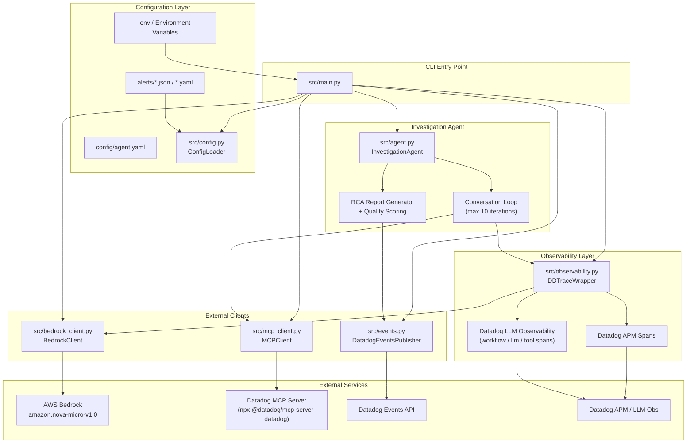
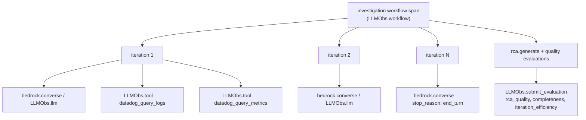
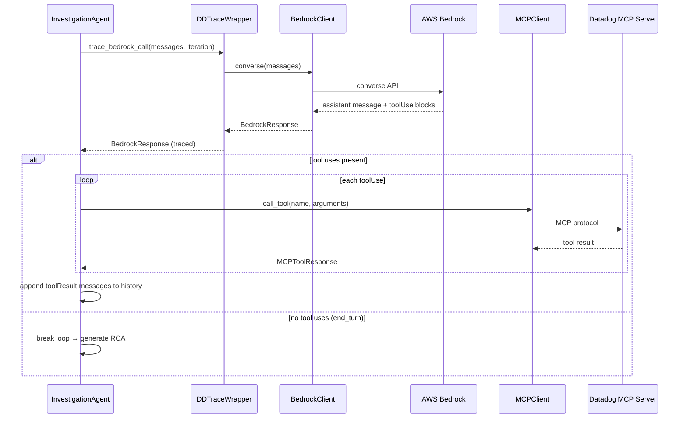

# Autonomous Incident Response Agent

A Python system that **autonomously investigates production alerts**, produces Root Cause Analysis (RCA) reports, and optionally **opens GitHub PRs** with code fixes. It combines:

- **AWS Bedrock** (`amazon.nova-micro-v1:0`) for conversational reasoning
- **Datadog MCP server** for observability tool calls (logs, metrics, traces, incidents)
- **Git/Code tools** — read local app source and open GitHub PRs via PyGithub
- **Financial Blast Radius Copilot** — instant WHAT BROKE + WHAT IT COSTS card before and after investigation
- **Datadog APM + LLM Observability** for tracing every LLM turn and tool call
- **Datadog Events API** for publishing RCA findings to on-call engineers

The agent runs a bounded investigation loop (default **10 iterations**). On each turn it asks Bedrock what to do next, executes Datadog tools via MCP when the model requests them, accumulates conversation history, and stops when the model finishes or the iteration budget is exhausted. It then generates an RCA report and publishes it as a Datadog Event.

---

## Table of Contents

- [What This Code Does](#what-this-code-does)
- [Architecture](#architecture)
- [Investigation Lifecycle](#investigation-lifecycle)
- [Module Reference](#module-reference)
- [Requirements](#requirements)
- [Installation](#installation)
- [Demo Setup Guide](#demo-setup-guide)
- [Configuration](#configuration)
- [Usage & Live Demo](#usage--live-demo)
- [Sample Output](#sample-output)
- [Testing](#testing)
- [Troubleshooting](#troubleshooting)
- [Project Structure](#project-structure)

---

## What This Code Does

### Problem

When an alert fires (e.g. checkout API error rate jumps from 0.1% to 15%), an on-call engineer must manually query logs, metrics, deployments, and dependencies to find root cause. That process is repetitive, slow, and expensive in incident time.

### Solution

This agent automates the **investigation phase** (not remediation):

| Step | What happens |
|------|----------------|
| 1. Load alert | Read a JSON/YAML scenario describing the alert name, description, and initial context |
| 2. Blast radius (instant) | Print WHAT BROKE (suspected) + WHAT IT COSTS ($/min) before any LLM call |
| 3. Connect tools | Start the Datadog MCP server over stdio; register GitHub code tools with Bedrock |
| 4. Investigate | Loop up to 10 times: Bedrock reasons → MCP/git tools execute → results fed back |
| 5. Generate RCA | Extract summary, merge confirmed blast radius (PR URL, confirmed root cause) |
| 6. Publish | POST the RCA + blast radius card to Datadog Events |
| 7. Trace | Every Bedrock call and tool execution is traced in Datadog APM / LLM Observability |

### Design principles

- **Config-driven** — new alert scenarios are YAML/JSON files, no code changes
- **Token budget** — hard cap on LLM turns prevents runaway cost
- **Graceful degradation** — individual tool failures are logged and the investigation continues; Bedrock/MCP connection failures terminate with a partial RCA
- **Observability-first** — all LLM calls instrumented for cost, latency, and quality scoring

---

## Architecture

### High-level component diagram



### Trace hierarchy (what appears in Datadog)



### Message flow (single iteration)



---

## Investigation Lifecycle

```
1. INITIALIZATION (main.py)
   ├─ Load .env
   ├─ Validate AWS + Datadog credentials
   ├─ Parse alert config → AlertScenario
   ├─ Initialize BedrockClient, MCPClient, DDTraceWrapper, DatadogEventsPublisher
   └─ MCPClient.connect() → spawn Datadog MCP server process

2. INVESTIGATION LOOP (agent.py) — max 10 iterations
   ├─ Compute preliminary blast radius → print WHAT BROKE + WHAT IT COSTS card
   ├─ Build initial user message from alert + blast radius context
   ├─ WHILE iteration < max_iterations:
   │   ├─ Log iteration.start (structured JSON)
   │   ├─ [TRACED] Bedrock converse() with git tool schemas → extract toolUse blocks
   │   ├─ Append assistant message to history
   │   ├─ IF no tool uses → natural completion, BREAK
   │   ├─ FOR EACH tool use:
   │   │   ├─ Datadog tools → MCP; git tools → git_tools.py
   │   │   ├─ On failure → log recoverable error, append error toolResult
   │   │   └─ On success → append toolResult to history
   │   └─ iteration++
   └─ IF max_iterations reached → terminate with partial RCA

3. RCA GENERATION (agent.py)
   ├─ Extract assistant text blocks as key_findings (max 10)
   ├─ Use last assistant message as investigation_summary
   ├─ Merge final blast radius (confirmed cause + PR URL) → print card
   ├─ Score RCA quality (completeness, iteration efficiency, tool usage, findings)
   └─ Submit quality evaluations to LLM Observability (if enabled)

4. PUBLISHING (events.py)
   ├─ Format RCA as Datadog Event (title, text, tags)
   ├─ POST to https://api.{DD_SITE}/api/v1/events
   └─ Retry up to 3× with exponential backoff on network/rate-limit errors

5. CLEANUP
   ├─ MCPClient.disconnect()
   └─ Print JSON summary to stdout
```

### Termination conditions

| Condition | Behavior |
|-----------|----------|
| Bedrock returns no `toolUse` blocks | Natural completion — full RCA |
| `iteration >= max_iterations` | Budget exhausted — RCA with findings so far |
| Bedrock auth/API error | Fatal — partial RCA with early-termination message |
| MCP connection lost | Fatal — partial RCA |
| Individual tool failure | Recoverable — error `toolResult` sent back to Bedrock, loop continues |

---

## Module Reference

### `src/main.py` — CLI entry point

Wires all components together. Parses CLI args, validates environment, loads the alert scenario, runs the investigation, publishes the RCA, and prints results.

```bash
python -m src.main <alert_config_path> [--scenario-index N]
```

**Key functions:**
- `_validate_environment()` — checks `AWS_ACCESS_KEY_ID`, `AWS_SECRET_ACCESS_KEY`, `DD_API_KEY`
- `_configure_logging()` — JSON-friendly logs, level from `LOG_LEVEL`
- `_load_dotenv()` — loads `.env` if `python-dotenv` is installed

---

### `src/config.py` — Configuration management

Loads and validates alert scenarios from JSON or YAML files.

**Classes:**
| Class | Purpose |
|-------|---------|
| `AlertScenario` | Dataclass: `name`, `description`, `initial_context`, `metadata` |
| `ConfigLoader` | `load_scenarios(path)` → `list[AlertScenario]` with schema validation |

**Required scenario fields:** `name`, `description`, `initial_context`, `metadata`

**Supported formats:** `.json`, `.yaml`, `.yml` — multiple scenarios per file via a top-level `scenarios` array.

---

### `src/bedrock_client.py` — AWS Bedrock integration

Wraps the Bedrock **Converse API** via boto3.

**Classes:**
| Class | Purpose |
|-------|---------|
| `BedrockClient` | `converse()`, `format_message()`, `extract_tool_uses()` |
| `BedrockResponse` | Parsed response: `message`, `stop_reason`, `usage`, `tool_uses` |
| `ToolUse` | Extracted tool call: `tool_use_id`, `name`, `input` |
| `BedrockAuthError` | AWS credential/authentication failure |
| `BedrockResponseError` | Invalid or unexpected API response |

**Default model:** `amazon.nova-micro-v1:0`  
**Auth:** `AWS_ACCESS_KEY_ID`, `AWS_SECRET_ACCESS_KEY`, `AWS_REGION` from environment.

---

### `src/mcp_client.py` — Datadog MCP integration

Connects to the Datadog MCP server over **stdio** using the official Python MCP SDK.

**Classes:**
| Class | Purpose |
|-------|---------|
| `MCPClient` | `connect()`, `call_tool()`, `disconnect()`, `is_connected()` |
| `MCPToolResponse` | `success`, `result`, `error` |
| `MCPConnectionError` | Connection failure (fatal) |

**Default server command:** `["npx", "-y", "@datadog/mcp-server-datadog"]` (requires Node.js)

---

### `src/agent.py` — Core investigation orchestrator

The heart of the system. Manages the Bedrock ↔ MCP conversation loop, iteration budget, error handling, RCA generation, and quality scoring.

**Classes:**
| Class | Purpose |
|-------|---------|
| `InvestigationAgent` | `investigate(scenario)` → `RCAReport` |
| `RCAReport` | `alert_name`, `investigation_summary`, `key_findings`, `iterations_used`, `timestamp`, `blast_radius` |
| `InvestigationError` | Structured error: `error_type`, `component`, `message`, `iteration` |

**Key methods:**
- `_conversation_turn()` — Bedrock call with `GIT_TOOL_CONFIG` + `SYSTEM_PROMPT`
- `_execute_tools()` — routes Datadog tools to MCP; `read_application_code` / `create_github_pr` to `git_tools`
- `_generate_rca()` — builds report, merges final blast radius card
- `_evaluate_rca_quality()` — scores completeness, iteration efficiency, tool usage, findings quality

**Structured log events:** `investigation.start`, `iteration.start`, `iteration.end`, `tool.call`, `tool.success`, `rca.generate`, `rca.complete`, `investigation.complete`

---

### `src/observability.py` — Datadog tracing wrapper

Instruments every Bedrock `converse()` call.

**Class:** `DDTraceWrapper`

**Two tracing modes:**
1. **LLM Observability SDK** (preferred) — `LLMObs.llm()` spans with full input/output message capture, token metrics, workflow and tool spans
2. **Basic APM fallback** — `tracer.trace("bedrock.converse")` with scenario tags and token metrics

**Tags captured:** `alert.scenario`, `model`, `iteration`, `bedrock.stop_reason`, `bedrock.input_tokens`, `bedrock.output_tokens`

---

### `src/events.py` — Datadog Events publisher

Publishes RCA reports to the Datadog Events v1 API.

**Class:** `DatadogEventsPublisher`

| Method | Purpose |
|--------|---------|
| `publish_rca(report, scenario_id)` | POST event, retry up to 3× |
| `_format_event(report, scenario_id)` | Build payload with title, text, tags |

**Event tags:** `agent:incident-response`, `scenario:{id}`, `iterations:{count}`

Event body includes the blast radius card (WHAT BROKE + WHAT IT COSTS) when available.

---

### `src/git_tools.py` — GitHub code tools

Native Bedrock tools for reading local app code and opening PRs (not routed through MCP).

| Export | Purpose |
|--------|---------|
| `read_application_code` | Read file from `DUMMY_APP_DIR/{filepath}` |
| `create_github_pr` | Commit fix to new branch, open PR via PyGithub |
| `GIT_TOOL_CONFIG` | Bedrock `toolConfig` payload for both tools |
| `execute_git_tool()` | Dispatcher called by `InvestigationAgent._execute_tools()` |

**Requires:** `GITHUB_TOKEN`, `GITHUB_REPO`, `DUMMY_APP_DIR`

---

### `src/blast_radius.py` — Financial Blast Radius Copilot

Computes unified technical + business impact before and after investigation.

| Class | Purpose |
|-------|---------|
| `BlastRadiusCalculator` | `compute_preliminary(scenario)`, `merge_final(preliminary, messages, summary)` |
| `BlastRadiusReport` | `technical` + `business` + `severity` + `alert_title` |
| `format_blast_radius_card()` | Judge-friendly WHAT BROKE / WHAT IT COSTS / RECOMMENDED ACTION card |

Business numbers come from alert `business_metrics` or env formula — never from the LLM.

---

## Requirements

| Requirement | Details |
|-------------|---------|
| Python | 3.10+ |
| Node.js | Required for Datadog MCP server (`npx`) |
| AWS account | Bedrock access in your region; `amazon.nova-micro-v1:0` enabled |
| Datadog account | API key + Application key (MCP tools); Events write permission |
| GitHub account | PAT + repo with PR write access (for `python demo.py` remediation) |
| Network | Outbound HTTPS to AWS Bedrock, Datadog APIs, and GitHub API |

---

## Installation

```bash
# 1. Clone / enter project
cd dd-hackathon

# 2. Create virtual environment
python -m venv venv

# 3. Activate (Windows)
venv\Scripts\activate
# Activate (macOS/Linux)
# source venv/bin/activate

# 4. Install dependencies
pip install -r requirements.txt

# 5. Verify setup
python verify_setup.py

# 6. Configure credentials
copy .env.example .env   # Windows
# cp .env.example .env   # macOS/Linux
# Edit .env with your AWS, Datadog, and GitHub keys (see Demo Setup Guide)
```

---

## Demo Setup Guide

This section walks through everything needed to run **`python demo.py`** end-to-end: the dummy app, alert incident, Datadog MCP, GitHub PR tools, and blast radius output.

### Quick checklist

Before the live demo, confirm all of the following:

| Component | Required | Verify |
|-----------|----------|--------|
| Python 3.10+ venv | Yes | `python --version` |
| Dependencies | Yes | `pip install -r requirements.txt` |
| Node.js (for MCP) | Yes | `node --version` |
| AWS Bedrock access | Yes | Nova Micro enabled in AWS Console |
| `DD_API_KEY` | Yes | Datadog → Organization Settings → API Keys |
| `DD_APP_KEY` | Recommended | Datadog → Application Keys (MCP tools + blast radius enrichment) |
| `GITHUB_TOKEN` | Yes (for PR demo) | PAT with `repo` + pull request write |
| `GITHUB_REPO` | Yes (for PR demo) | Target repo in `owner/repo` format |
| `dummy_app/` | Yes | Bundled — no install step |

### Step 1 — Clone, venv, and install

```bash
cd dd-hackathon
python -m venv venv

# Windows
venv\Scripts\activate

# macOS/Linux
# source venv/bin/activate

pip install -r requirements.txt
python verify_setup.py
```

### Step 2 — Configure `.env`

Copy the template and fill in credentials:

```bash
copy .env.example .env   # Windows
# cp .env.example .env   # macOS/Linux
```

**Minimum for `python demo.py`:**

```env
# AWS — Bedrock reasoning
AWS_REGION=us-east-1
AWS_ACCESS_KEY_ID=...
AWS_SECRET_ACCESS_KEY=...

# Datadog — events, tracing, MCP server auth
DD_API_KEY=...
DD_SITE=datadoghq.com
DD_APP_KEY=...          # strongly recommended for MCP tool calls

# GitHub — read code + open PR (demo remediation)
GITHUB_TOKEN=ghp_...
GITHUB_REPO=your-org/your-repo
DUMMY_APP_DIR=./dummy_app
```

See [Configuration](#configuration) for the full variable list including blast-radius formula overrides.

### Step 3 — Understand the dummy app

The **`dummy_app/`** directory is a minimal Python service used as the “production codebase” during the demo. The agent reads files from here and submits fixes to your GitHub repo.

```
dummy_app/
└── services/
    └── orders.py    ← intentionally buggy; agent reads and rewrites this file
```

**`dummy_app/services/orders.py`** contains two deliberate bugs aligned with the demo incident:

| Bug | Incident ID | Symptom |
|-----|-------------|---------|
| `requests.get()` with **no timeout** | inc_43 | Threads hang indefinitely on slow upstream |
| **N+1 HTTP pattern** — one request per order for line items | inc_13 | Connection pool exhaustion, 502/504 under load |

The file header documents the bugs. **Do not fix them manually** before the demo — the agent is meant to detect, rewrite, and PR the fix.

The path the agent uses is controlled by `DUMMY_APP_DIR` (default `./dummy_app`). The alert points at `services/orders.py`, which resolves to `dummy_app/services/orders.py`.

### Step 4 — Understand the alert incident

The canonical demo scenario lives in **`alerts/demo_live.json`**. It simulates a checkout API error spike and tells the agent exactly what to investigate.

**Key fields in `initial_context`:**

| Field | Demo value | Purpose |
|-------|------------|---------|
| `incident_ids` | `["inc_43", "inc_13"]` | Links to known bug patterns |
| `incident_43_issue` / `incident_13_issue` | Timeout + N+1 descriptions | Feeds suspected root cause |
| `service` / `endpoint` | `checkout-service` / `/api/checkout` | Blast radius + Datadog context |
| `suspected_file` | `services/orders.py` | Tells agent which file to read |
| `suspected_technical_cause` | N+1 + missing timeouts | Instant WHAT BROKE card |
| `business_metrics` | 42 customers, $145/min | Judge-tuned WHAT IT COSTS numbers |
| `symptoms` / `error_codes` | 502/504, pool exhaustion | Shown on blast radius card |

**`investigation_prompt`** instructs the agent to: query Datadog → read `services/orders.py` → rewrite the fix → call `create_github_pr` → include the PR URL in the final RCA.

Run explicitly (same as `demo.py`):

```bash
python -m src.main alerts/demo_live.json
```

### Step 5 — Datadog MCP server

The agent spawns the **Datadog MCP server** as a child process over stdio. Bedrock calls Datadog tools (logs, metrics, traces) through this server — not through direct HTTP from Python.

**Default launch command** (set in `.env` or use default):

```json
["npx", "-y", "@datadog/mcp-server-datadog"]
```

**Prerequisites:**

1. **Node.js** installed (`node --version`)
2. **`DD_API_KEY`** in environment (agent loads `.env` at startup)
3. **`DD_APP_KEY`** recommended — many Datadog MCP tools require an Application Key

**Verify MCP starts manually:**

```bash
# Windows — set keys first
set DD_API_KEY=your-key
set DD_APP_KEY=your-app-key
npx -y @datadog/mcp-server-datadog
```

First run downloads the package via npx; allow ~30s. The agent connects automatically when you run `demo.py` — you do not start MCP separately.

**Tool routing in the agent:**

| Tool names | Routed to |
|------------|-----------|
| Datadog MCP tools (`query_logs`, `query_metrics`, etc.) | MCP server |
| `read_application_code`, `create_github_pr` | Local `git_tools.py` (not MCP) |

### Step 6 — GitHub setup (PR demo)

When the agent confirms an application-level root cause, it uses two **native Bedrock tools** (not MCP):

1. **`read_application_code`** — reads `DUMMY_APP_DIR/{filepath}`
2. **`create_github_pr`** — commits the fixed file to a new branch and opens a PR via PyGithub

**GitHub PAT requirements:**

- Scopes: **`repo`** (full control of private repositories) or equivalent write access
- Permission to **create branches** and **open pull requests** on `GITHUB_REPO`

**`GITHUB_REPO` format:** `owner/repo` (e.g. `acme-corp/payments-service`)

**Important:** The PR is opened against **`GITHUB_REPO`**, but the source code is read from **`DUMMY_APP_DIR`**. For the demo, use a repo where committing `services/orders.py` (or the path in the alert) is acceptable — a throwaway fork or demo repo works well.

**Verify GitHub access:**

```bash
# Optional — confirm token works (requires gh CLI)
gh auth status
gh repo view your-org/your-repo
```

If `create_github_pr` fails, the agent still completes the RCA and prints the corrected code inline in the summary.

### Step 7 — Financial Blast Radius (automatic)

No extra setup required. On investigation start, the agent prints a **Financial Blast Radius card** with:

- **WHAT BROKE** — suspected cause from the alert (instant, before Bedrock)
- **WHAT IT COSTS** — customers stuck, $/min bleed rate, 30-min projected loss (from `business_metrics` in the alert)
- **RECOMMENDED ACTION** — runbook title + estimated savings

At investigation end, the card updates to **CONFIRMED** with the PR URL (if created). Dollar amounts are **never LLM-generated** — they come from `BlastRadiusCalculator` only.

Optional: set `DD_APP_KEY` to enrich stuck-customer counts from live Datadog error metrics instead of simulated values.

### Step 8 — Run the demo

```bash
venv\Scripts\activate
python demo.py
```

**Expected timeline:**

1. **Instant** — blast radius card (suspected cause + $145/min)
2. **~30s** — MCP server spawns (first run may download npx package)
3. **During** — Bedrock turns, Datadog tool calls, `read_application_code`, `create_github_pr`
4. **End** — confirmed blast radius card, JSON stdout with `blast_radius`, Datadog Event published

Verbose logging:

```bash
set LOG_LEVEL=DEBUG
python demo.py
```

---

## Configuration

### Environment variables (`.env`)

| Variable | Required | Default | Description |
|----------|----------|---------|-------------|
| `AWS_ACCESS_KEY_ID` | Yes | — | AWS credentials for Bedrock |
| `AWS_SECRET_ACCESS_KEY` | Yes | — | AWS secret key |
| `AWS_REGION` | No | `us-east-1` | Bedrock region |
| `DD_API_KEY` | Yes | — | Datadog API key (events, tracing, MCP auth) |
| `DD_APP_KEY` | Recommended | — | Datadog Application Key — required for most MCP tools; optional blast radius enrichment |
| `DD_SITE` | No | `datadoghq.com` | Datadog site (`datadoghq.eu`, etc.) |
| `DD_SERVICE` | No | `incident-response-agent` | APM service name |
| `DD_ENV` | No | `production` | APM environment tag |
| `GITHUB_TOKEN` | Yes (PR demo) | — | GitHub PAT with repo + PR write scope |
| `GITHUB_REPO` | Yes (PR demo) | — | Target repo as `owner/repo` |
| `DUMMY_APP_DIR` | No | `./dummy_app` | Local app code the agent reads via `read_application_code` |
| `AVG_ORDER_VALUE_USD` | No | `29.99` | Blast radius formula — average order value |
| `CHECKOUT_ATTEMPTS_PER_CUSTOMER_PER_MIN` | No | `0.35` | Blast radius formula — checkout attempts per customer per minute |
| `RUNBOOK_MTTR_SAVINGS_MINUTES` | No | `14` | Minutes of bleed rate saved if runbook applied |
| `MAX_ITERATIONS` | No | `10` | Max Bedrock turns per investigation |
| `LOG_LEVEL` | No | `INFO` | `DEBUG`, `INFO`, `WARNING`, `ERROR` |
| `MCP_SERVER_COMMAND` | No | `["npx","-y","@datadog/mcp-server-datadog"]` | JSON array — MCP server launch command |
| `BEDROCK_MODEL_ID` | No | `amazon.nova-micro-v1:0` | Bedrock model override |

### Alert scenario format

Alert files live in `alerts/` as JSON or YAML. Each file contains a top-level `scenarios` array. The demo uses **`alerts/demo_live.json`** — see [Demo Setup Guide](#demo-setup-guide) for field-by-field explanation.

**Minimal JSON example** (`alerts/high_error_rate.json`):

```json
{
  "version": "1.0",
  "scenarios": [
    {
      "id": "checkout-high-errors",
      "name": "High Error Rate - Checkout API",
      "description": "Error rate spike on /api/checkout endpoint",
      "initial_context": {
        "alert_time": "2024-01-15T14:30:00Z",
        "service": "checkout-service",
        "error_rate_current": "15%"
      },
      "metadata": {
        "severity": "high",
        "team": "payments"
      }
    }
  ]
}
```

**Demo scenario with blast radius + code fix** (`alerts/demo_live.json` — excerpt):

```json
{
  "initial_context": {
    "service": "checkout-service",
    "endpoint": "/api/checkout",
    "suspected_file": "services/orders.py",
    "suspected_technical_cause": "N+1 HTTP + missing timeouts in services/orders.py",
    "business_metrics": {
      "stuck_customers": 42,
      "financial_bleed_rate_usd_per_min": 145,
      "runbook_savings_usd": 2000
    }
  },
  "investigation_prompt": "… read services/orders.py, create_github_pr, include PR URL …"
}
```

**YAML** (`alerts/database_slowdown.yaml`):

```yaml
version: "1.0"
scenarios:
  - id: "postgres-slow-queries"
    name: "Database Query Performance Degradation"
    description: "PostgreSQL query latency increased 5x"
    initial_context:
      database: "orders-db"
      current_p95: "250ms"
    metadata:
      severity: "critical"
      team: "database"
```

**Bundled scenarios:**

| File | Scenario | Demo command |
|------|----------|--------------|
| `alerts/demo_live.json` | **Live demo** — inc_43 + inc_13, checkout timeouts + N+1 | `python demo.py` |
| `alerts/high_error_rate.json` | Checkout API 15% error rate spike | `python -m src.main alerts/high_error_rate.json` |
| `alerts/database_slowdown.yaml` | PostgreSQL p95 latency 5× degradation | `python -m src.main alerts/database_slowdown.yaml` |
| `alerts/example_alert.yaml` | Generic example scenario | `python -m src.main alerts/example_alert.yaml` |

---

## Usage & Live Demo

> **First time?** Complete the [Demo Setup Guide](#demo-setup-guide) before running live demos.

### Prerequisites checklist

Before running a live demo, confirm:

- [ ] Python venv activated, dependencies installed (`python verify_setup.py`)
- [ ] `.env` filled with AWS, Datadog, and GitHub credentials
- [ ] Node.js installed (`node --version`)
- [ ] Bedrock model access enabled in AWS Console (Model access → `Amazon Nova Micro`)
- [ ] `dummy_app/services/orders.py` present (bundled — bugs intentional)
- [ ] `GITHUB_REPO` is a repo where opening a PR is safe for demo
- [ ] Datadog MCP can auth: `DD_API_KEY` + `DD_APP_KEY` set in `.env`

### Demo 1 — One-command live demo (recommended)

Runs the canonical checkout incident (**inc_43** missing timeouts + **inc_13** N+1 pattern) against `alerts/demo_live.json` and `dummy_app/services/orders.py`:

```bash
venv\Scripts\activate
python demo.py
```

One command. The agent will:

1. Print the **Financial Blast Radius** card (instant)
2. Query Datadog via MCP (logs, metrics, traces)
3. Read `services/orders.py` from `dummy_app/`
4. Open a **GitHub PR** with the fix
5. Print the confirmed blast radius card + RCA JSON
6. Publish the RCA to **Datadog Events**

Optional verbose logging:

```bash
set LOG_LEVEL=DEBUG
python demo.py
```

Equivalent explicit form (same scenario):

```bash
python -m src.main alerts/demo_live.json
```

**What to watch during the demo:**

0. **Financial Blast Radius card** prints immediately (before Bedrock runs) — suspected cause + $/min bleed rate; updated again at end with confirmed root cause + PR URL

1. **Structured JSON logs** on stdout — `investigation.start` → `iteration.start` → `tool.call` → `iteration.end` → `rca.complete`
2. **MCP server** spawns as a child process (first run may download `@datadog/mcp-server-datadog` via npx)
3. **Git tools** — `read_application_code` reads `dummy_app/`; `create_github_pr` opens PR on `GITHUB_REPO`
4. **Bedrock** receives alert context + blast radius numbers; must not invent dollar amounts
5. **Final JSON block** with `investigation_summary`, `key_findings`, `blast_radius`, `events_published`

### Demo 2 — Database slowdown scenario (YAML)

```bash
python -m src.main alerts/database_slowdown.yaml
```

### Demo 3 — Select a specific scenario index

When a config file contains multiple scenarios:

```bash
python -m src.main alerts/example_alert.yaml --scenario-index 0
```

### Demo 4 — Lower iteration budget (faster/cheaper demo)

```bash
set MAX_ITERATIONS=3
python -m src.main alerts/high_error_rate.json
```

### Demo 5 — View traces in Datadog (LLM Observability)

With `DD_API_KEY` set, the agent enables LLM Observability automatically:

1. Run an investigation (Demo 1)
2. Open **Datadog → LLM Observability** (or APM → Traces)
3. Filter by service: `incident-response-agent`
4. You should see:
   - **Workflow span:** `incident_investigation`
   - **LLM spans:** one per Bedrock turn with input/output messages and token counts
   - **Tool spans:** one per MCP tool call
   - **Evaluations:** `rca_quality`, `completeness`, `iteration_efficiency`

### Demo 6 — View RCA in Datadog Events

After a successful run with `events_published: true`:

1. Open **Datadog → Events**
2. Search: `source:incident-response-agent` or `agent:incident-response`
3. Event title = alert name; body = summary + bullet findings

### Demo 7 — Unit tests only (no credentials needed)

```bash
python -m pytest tests/ -k "not integration" -v
```

Expected: **156+ unit tests passing** (Bedrock, MCP, config, agent, git tools, blast radius, observability, events — all mocked).

### Demo 8 — Integration tests (requires live credentials)

```bash
# Bedrock real API (needs AWS credentials)
python -m pytest tests/integration/test_bedrock_real.py -v -s

# MCP real server (needs Node.js + npx)
python -m pytest tests/integration/test_mcp_real.py -v -s
```

Integration tests skip gracefully when credentials or services are unavailable.

---

## Sample Output

### Structured logs (INFO level)

```json
{"event": "startup.scenario_selected", "scenario_id": "high-error-rate---checkout-api", "alert_name": "High Error Rate - Checkout API"}
{"event": "investigation.start", "scenario": "High Error Rate - Checkout API", "max_iterations": 10}
{"event": "iteration.start", "iteration": 1, "scenario": "High Error Rate - Checkout API", "message_count": 1}
{"event": "iteration.end", "iteration": 1, "scenario": "High Error Rate - Checkout API", "stop_reason": "tool_use", "tool_uses": 1}
{"event": "tool.call", "tool": "datadog_query_logs", "tool_use_id": "abc123", "iteration": 1, "scenario": "High Error Rate - Checkout API"}
{"event": "investigation.complete", "scenario": "High Error Rate - Checkout API", "iterations": 4, "reason": "natural_completion"}
{"event": "rca.complete", "alert_name": "High Error Rate - Checkout API", "iterations_used": 4, "findings_count": 3, "quality_score": 0.82, "quality_rating": "good"}
{"event": "events.published", "scenario_id": "high-error-rate---checkout-api", "alert_name": "High Error Rate - Checkout API"}
```

### Final stdout JSON

```json
{
  "alert_name": "Checkout API Error Spike — Missing HTTP Timeouts + N+1 Pattern",
  "investigation_summary": "WHAT BROKE: N+1 HTTP pattern + missing timeouts in services/orders.py\nWHAT IT COSTS: 42 customers stuck, $145/min...",
  "key_findings": ["..."],
  "iterations_used": 6,
  "timestamp": "2024-01-15T15:05:00.123456+00:00",
  "events_published": true,
  "blast_radius": {
    "alert_title": "Checkout API Error Spike — Missing HTTP Timeouts + N+1 Pattern",
    "severity": "High",
    "technical": {
      "service": "checkout-service",
      "endpoint": "/api/checkout",
      "status": "confirmed",
      "fix_pr_url": "https://github.com/owner/repo/pull/42"
    },
    "business": {
      "affected_customers": 42,
      "financial_bleed_rate_usd_per_min": 145.0,
      "estimated_loss_next_30_min_usd": 4350.0,
      "runbook_estimated_savings_usd": 2000.0
    }
  }
}
```

### Financial Blast Radius card (stdout)

Printed twice — at investigation start (SUSPECTED) and after RCA (CONFIRMED):

```
==========================================
  FINANCIAL BLAST RADIUS COPILOT
==========================================

WHAT BROKE
  Status:      CONFIRMED
  Service:     checkout-service (/api/checkout)
  File:        services/orders.py
  Root cause:  N+1 HTTP + missing timeouts in services/orders.py
  Fix PR:      https://github.com/owner/repo/pull/42

WHAT IT COSTS
  Customers stuck right now:     42
  Financial bleed rate:        $145/min
  Projected loss (30 min):       $4,350

RECOMMENDED ACTION
  Runbook: Route traffic to backup database
  Estimated savings if applied now: ~$2,000
```

---

## Testing

```bash
# All unit tests (no external services)
python -m pytest tests/ -k "not integration" -v

# With coverage report
python -m pytest tests/ -k "not integration" --cov=src --cov-report=html
# Open htmlcov/index.html

# Specific module
python -m pytest tests/test_agent.py -v
python -m pytest tests/test_bedrock_client.py -v
python -m pytest tests/test_mcp_client.py -v
python -m pytest tests/test_config.py -v
python -m pytest tests/test_observability.py -v
python -m pytest tests/test_events.py -v

# Code quality
black src/ tests/
ruff check src/ tests/
mypy src/
```

| Test file | What it covers |
|-----------|----------------|
| `test_bedrock_client.py` | Message formatting, tool extraction, mocked boto3 |
| `test_mcp_client.py` | Connection lifecycle, tool routing, error handling |
| `test_config.py` | JSON/YAML loading, schema validation, error cases |
| `test_agent.py` | Investigation loop, iteration counter, RCA, blast radius, error paths |
| `test_git_tools.py` | Code read, GitHub PR creation, tool routing |
| `test_blast_radius.py` | Preliminary/final cards, formula, PR URL extraction |
| `test_observability.py` | DDTrace span tags, token metrics, error marking |
| `test_events.py` | Event formatting, retry logic, auth failures |
| `integration/test_bedrock_real.py` | Live Bedrock API (skipped without AWS creds) |
| `integration/test_mcp_real.py` | Live MCP server (skipped without Node/npx) |

---

## Troubleshooting

| Symptom | Likely cause | Fix |
|---------|--------------|-----|
| `startup.missing_env` for AWS keys | `.env` not loaded or empty | Copy `.env.example` → `.env`, fill credentials |
| `startup.missing_env` for `DD_API_KEY` | Datadog key missing | Set in `.env`; required for events + MCP |
| `startup.mcp_connection_failed` | Node.js missing or npx blocked | Install Node.js; test `npx -y @datadog/mcp-server-datadog` manually |
| MCP tools return auth errors | Missing `DD_APP_KEY` | Create Application Key in Datadog; add to `.env` |
| `BedrockAuthError` | Invalid AWS creds or no Bedrock access | Verify IAM permissions; enable Nova Micro in Bedrock console |
| `read_application_code` file not found | Wrong `DUMMY_APP_DIR` or filepath | Default `./dummy_app`; alert uses `services/orders.py` |
| `create_github_pr` fails (403/404) | Invalid `GITHUB_TOKEN` or wrong `GITHUB_REPO` | PAT needs `repo` scope; verify `owner/repo` format |
| PR opens but wrong file path | Repo layout differs from `dummy_app` | Use a demo repo that accepts `services/orders.py` at repo root |
| Blast radius shows wrong $/min | Missing `business_metrics` in alert | Use `alerts/demo_live.json` or add `business_metrics` block |
| `events.auth_error` (403) | Invalid `DD_API_KEY` | Regenerate key in Datadog → Organization Settings → API Keys |
| `events_published: false` | Network or rate limit | Check connectivity; RCA still in stdout JSON |
| Investigation completes in 1 iteration with no tools | Model chose not to use tools | Normal for some prompts; try `LOG_LEVEL=DEBUG` |
| `LLM Observability SDK not available` warning | Older ddtrace version | `pip install -U ddtrace`; agent falls back to basic APM tracing |

---

## Project Structure

```
dd-hackathon/
├── demo.py                  # One-command demo → alerts/demo_live.json
├── dummy_app/               # Intentionally buggy app code for PR demo
│   └── services/
│       └── orders.py        # inc_43 (no timeout) + inc_13 (N+1)
├── src/
│   ├── main.py              # CLI entry point — wires everything together
│   ├── agent.py             # InvestigationAgent, RCAReport, conversation loop
│   ├── bedrock_client.py    # AWS Bedrock Converse API client
│   ├── mcp_client.py        # Datadog MCP server client (stdio)
│   ├── git_tools.py         # read_application_code, create_github_pr
│   ├── blast_radius.py      # Financial Blast Radius Copilot
│   ├── config.py            # Alert scenario loader (JSON/YAML)
│   ├── observability.py     # DDTrace + LLM Observability wrapper
│   └── events.py            # Datadog Events API publisher
├── tests/
│   ├── test_agent.py
│   ├── test_bedrock_client.py
│   ├── test_mcp_client.py
│   ├── test_git_tools.py
│   ├── test_blast_radius.py
│   ├── test_config.py
│   ├── test_observability.py
│   ├── test_events.py
│   └── integration/         # Live AWS / MCP tests (optional)
├── alerts/
│   ├── demo_live.json       # Canonical live demo (inc_43 + inc_13)
│   ├── high_error_rate.json # Demo: checkout API errors
│   ├── database_slowdown.yaml
│   └── example_alert.yaml
├── config/
│   └── agent.yaml           # Reference agent settings (not loaded by CLI yet)
├── .env.example             # Environment variable template
├── requirements.txt         # Python dependencies
├── pyproject.toml           # Project metadata + pytest/black/ruff config
├── verify_setup.py          # Setup validation script
└── README.md                # This file
```

---

## Dependencies

| Package | Purpose |
|---------|---------|
| `boto3` | AWS SDK — Bedrock Converse API |
| `ddtrace` | Datadog APM + LLM Observability SDK |
| `pyyaml` | YAML alert config parsing |
| `requests` | Datadog Events API HTTP client |
| `mcp` | Model Context Protocol Python client |
| `PyGithub` | GitHub REST API — `create_github_pr` tool |
| `python-dotenv` | Optional `.env` file loading |

**Dev:** `pytest`, `pytest-cov`, `pytest-asyncio`, `hypothesis`, `black`, `mypy`, `ruff`

---

## License

(Add license information)

## Contributing

(Add contribution guidelines)
