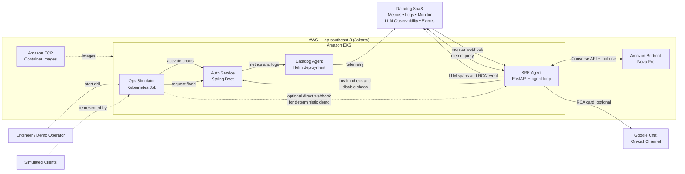
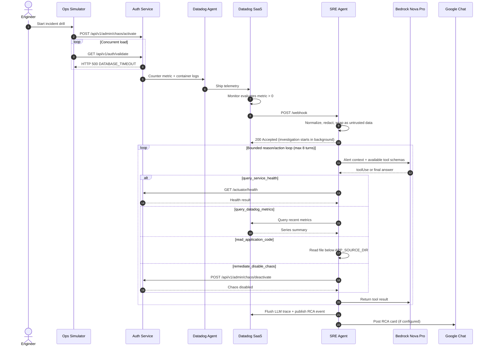
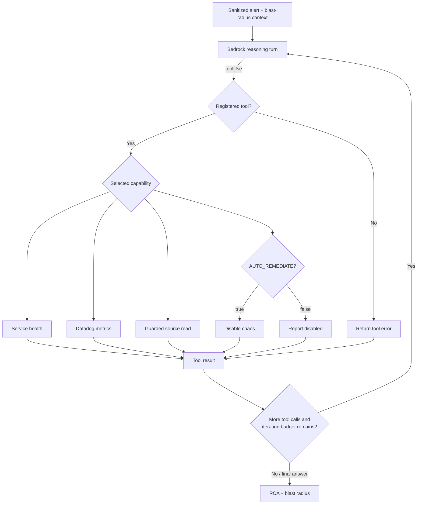
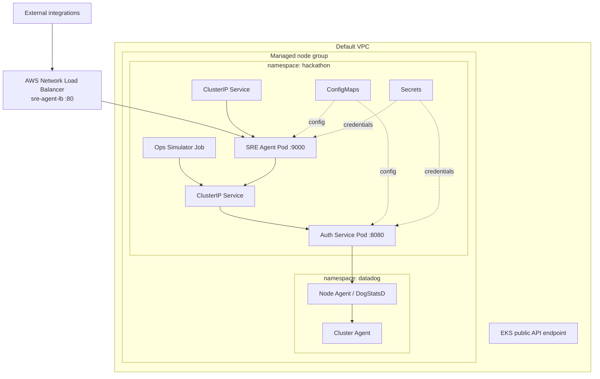

# High-Level Design — Autonomous SRE Incident-Response Agent

## 1. Executive summary

This project shows a **closed-loop incident response system** running on Amazon EKS.

The simulator creates a problem in `auth-service` and sends traffic to it. Datadog collects metrics and logs from the cluster. A Datadog monitor detects the database timeout and sends an alert to `sre-agent`.

The agent cleans unsafe input first. It then uses Amazon Bedrock Nova Pro to choose investigation steps. The agent can check the service, query Datadog, read application code, and run one limited auto-remediation action. Finally, it sends the Root Cause Analysis (RCA) to Datadog and Google Chat.

The main value is not the chatbot. The main value is the automated operations cycle:

> Detect → sanitize → investigate → reason and act → remediate → report → observe the AI itself.

## 2. System context



## 3. Main components

| Component | Responsibility | Technology / interface |
|---|---|---|
| `ops-simulator` | Activates chaos, floods the validation endpoint, runs security probes, and can send a synthetic Datadog-style webhook | Java, Kubernetes Job, HTTP |
| `auth-service` | Demo application under test. In chaos mode it burns CPU, waits, throws `DatabaseTimeoutException`, returns HTTP 500, and increments `auth.errors.database_timeout` | Spring Boot, Micrometer, Actuator |
| Datadog Agent | Collects cluster state, container logs, processes, DogStatsD metrics, and exposes the trace-agent endpoint | Datadog Helm chart on EKS |
| Datadog monitor | Alerts when the database-timeout counter is greater than zero and routes the notification to the SRE agent webhook | Terraform-managed Datadog resources |
| `sre-agent` API | Exposes `/healthz`, `/webhook`, and `/invoke`; sanitizes inbound content synchronously and starts investigations | Python, FastAPI |
| Guardrail layer | Normalizes obfuscation and redacts prompt injection, credentials, PII, command injection, and SQL injection | Deterministic regex/Unicode handling; optional Bedrock Guardrail |
| Investigation loop | Runs a bounded Nova Pro conversation. The model chooses tools; results are returned into the next turn until a final RCA is produced | Bedrock Converse API, maximum 8 iterations by default |
| Agent tools | Checks health, queries Datadog metrics, reads allow-listed local source, and deactivates the known chaos fault | HTTP, Datadog API, guarded filesystem read |
| LLM Observability | Captures workflow/task/LLM/tool spans, token usage, estimated cost, outputs, and errors | Datadog `ddtrace.llmobs`, agentless mode |
| Result publishers | Sends the RCA/blast-radius result to Datadog Events and optionally Google Chat | HTTP webhooks/APIs |
| Infrastructure | Provisions EKS, managed node group, IAM roles, and Datadog installation; deploys workloads and services | Terraform, Kubernetes, ECR, CodeBuild buildspecs |

## 4. End-to-end incident sequence



## 5. Agent decision model

The LLM does not have shell or Kubernetes access. It can only select one of these four registered tools:

1. `query_service_health` — read-only HTTP health check.
2. `query_datadog_metrics` — read-only query over the last 15 minutes.
3. `read_application_code` — read-only access below `APP_SOURCE_DIR`; path traversal is rejected.
4. `remediate_disable_chaos` — one narrow write action: call the known chaos-deactivation endpoint. It can be globally disabled with `AUTO_REMEDIATE=false`.

This is a **bounded autonomy** design. Bedrock decides the order of the investigation. The application code still controls the available tools, maximum iterations, file access, and remediation scope.



## 6. Deployment view

The Terraform stack uses the default VPC and its subnets. It creates a public EKS control-plane endpoint and a managed EC2 node group. It also installs Datadog with Helm. The application runs in the `hackathon` namespace.



## 7. Observability design

The system has two telemetry paths:

- **Application and platform telemetry:** `auth-service` sends a Micrometer counter through DogStatsD and writes container logs. The Datadog Agent sends this data to Datadog. The Agent also collects Kubernetes state and process data.
- **AI agent telemetry:** `sre-agent` uses Datadog LLM Observability in agentless mode. One investigation becomes one workflow trace. The trace contains preparation tasks, Bedrock calls, tool calls, and RCA generation. Each LLM span also contains token usage and estimated cost.

Expected LLM trace shape:

```text
workflow: incident_investigation
├── task: frame_investigation
├── llm: bedrock.converse.iter_1
├── tool: query_service_health
├── llm: bedrock.converse.iter_2
├── tool: query_datadog_metrics / read_application_code
├── llm: bedrock.converse.iter_3
├── tool: remediate_disable_chaos
├── llm: bedrock.converse.iter_N
└── task: generate_rca
```

## 8. Security and reliability controls

- The webhook responds immediately and runs genuine-alert investigations in a background task.
- Security test payloads are cleaned, but they do not start a Bedrock investigation.
- Alert text is normalized, redacted, and wrapped as untrusted data before model use.
- Managed Bedrock Guardrails can be added, but the deterministic sanitizer remains active regardless.
- Tools are allow-listed. The model cannot create or run other capabilities.
- Source reads are constrained to a configured root directory.
- Auto-remediation can be disabled, and the only implemented remediation is fault deactivation.
- The agent has a fixed iteration limit. It returns a partial RCA if Bedrock fails.
- The pod runs as non-root with a read-only root filesystem and dropped Linux capabilities.
- Health probes and resource requests/limits exist for both primary services.
- Datadog event publication retries transient failures; notification failures do not fail the investigation.

## 9. Demo paths

There are two ways to demo the system. Explain clearly which path you are using.

### A. Full observability path

`ops-simulator → auth-service → DogStatsD/Datadog Agent → Datadog monitor → webhook → sre-agent`

Use this path to prove the real monitoring integration. It needs working metric ingestion, Datadog monitor evaluation, and a public SRE-agent webhook.

### B. Deterministic hackathon path

`ops-simulator → auth-service`, followed by `ops-simulator → sre-agent` using a synthetic Datadog-style webhook.

Use this path when demo time is limited. It still shows input cleaning, Bedrock reasoning, tool calls, remediation, LLM tracing, and RCA publishing. However, it does **not** prove that the Datadog monitor sent the alert.

## 10. Implementation caveats and gaps

Explain these limitations clearly during the presentation:

1. **The incident is created on purpose.** There is no real database or connection pool. `auth-service` simulates the problem with high CPU work, a delay, and an exception.
2. **The business impact numbers are simulated.** Customer count and financial loss come from the demo scenario or a fixed formula. They do not come from real business systems.
3. **The health endpoint may still return `UP`.** `/actuator/health` does not check the chaos state. The failed validation request is stronger evidence than the current health result.
4. **Java APM is not enabled in the current deployment.** The Datadog Agent can receive APM data, but `auth-service` does not attach the Datadog Java agent. The monitor uses a custom metric instead of APM traces.
5. **The load balancer is public.** The `/webhook`, `/invoke`, and chaos admin endpoints do not have application authentication. A production system needs private ingress or API Gateway, TLS, signed requests, network policies, and endpoint authentication.
6. **The current design uses static AWS keys.** A production EKS setup should use EKS Pod Identity or IRSA and Secrets Manager.
7. **The current SRE-agent deployment has one replica.** Some README text says two or more replicas. Do not make this claim unless the real cluster or HPA shows it.
8. **Background tasks are not durable.** A pod restart can stop an accepted investigation. A production system should place investigation jobs in SQS or another durable queue.
9. **The agent reads a bundled copy of the source code.** It reads `/app/app_under_test`. It does not fetch the exact deployed Git commit.
10. **Model cost is an estimate.** The prices are constants in the source code and may become outdated.

## 11. Production evolution

Recommended next changes, in priority order:

1. Add SQS between the webhook and investigation workers. Use the monitor or event ID to prevent duplicate work.
2. Replace static AWS keys with EKS Pod Identity or IRSA. Give the pod access only to the required Bedrock model and actions.
3. Authenticate and sign webhooks. Keep the SRE agent behind a controlled private ingress.
4. Require human approval for high-risk remediation. Define policies for each tool, service, and environment.
5. After remediation, test the failed endpoint and confirm that the Datadog metric has recovered.
6. Attach the Datadog Java agent for APM. Connect the monitor, application trace, LLM investigation, and remediation event.
7. Read code and configuration from the exact deployed image or Git commit.
8. Replace simulated business impact with real SLO, service ownership, and revenue data.

## 12. Suggested presentation storyline

### One-sentence pitch

“We built an autonomous SRE agent that receives Datadog alerts, uses Amazon Bedrock and tools to investigate incidents, runs limited remediation, and sends an RCA. Datadog also observes every step of the AI workflow.”

### Five-minute flow

1. **Problem (30 seconds):** on-call engineers spend time checking alerts, metrics, code, and runbooks while the incident continues.
2. **Architecture (60 seconds):** show the system diagram and explain the closed loop.
3. **Live incident (90 seconds):** activate chaos, show the HTTP 500 error and custom metric, then show the agent's tool calls and remediation.
4. **Evidence (60 seconds):** show the Datadog monitor, RCA event, and LLM trace. Point out the workflow, model calls, tools, tokens, cost, and errors.
5. **Safety and value (60 seconds):** explain input guardrails, allow-listed tools, limited iterations, limited remediation, and simulated business impact.

### Key message per subsystem

- **AWS:** EKS runs the system. Bedrock Nova Pro provides tool-based reasoning in the Jakarta region.
- **Datadog:** detects the incident and observes the AI agent, including tool calls and model cost.
- **Agent:** changes an alert into actions based on evidence. It does not have unrestricted infrastructure access.
- **Infrastructure:** Terraform and Kubernetes make the demo repeatable. More security and reliability work is still needed for production.

## 13. Source map

| Concern | Primary implementation |
|---|---|
| EKS and Datadog Agent provisioning | `infra/eks/main.tf` |
| Monitor, webhook, and SLO | `infra/datadog/monitors.tf` |
| Runtime deployment | `k8s/*` |
| Fault and custom metric | `auth-service/src/main/java/.../AuthValidationService.java`, `GlobalExceptionHandler.java` |
| Drill generation | `ops-simulator/src/main/java/...` |
| Webhook and guardrails | `sre-agent/app/server.py`, `guardrails.py` |
| Bedrock loop and tools | `sre-agent/app/agent.py`, `bedrock_client.py`, `tools.py` |
| LLM telemetry | `sre-agent/app/observability.py` |
| RCA and notifications | `sre-agent/app/blast_radius.py`, `events.py`, `chat_notifier.py` |
